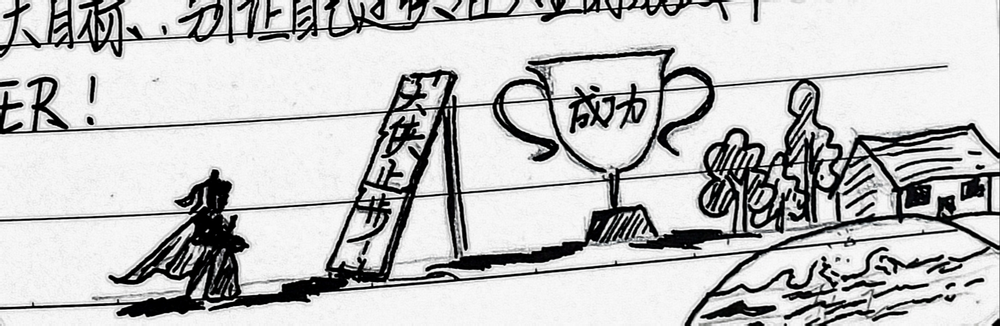

> 收起地铺卧在床板睡觉一直不得安稳，半夜总觉有东西硌我腰。盛怒之下一把把床单揪起，褥穷笔记本现。竟是五年前我的日记本！忍住找了个没人的地儿小心翻阅，呀哒，这熊孩子当年稚嫩得可爱。

以下是日记摘录(其二)。 
### 二零一四年五月十八日 &nbsp;&nbsp;&nbsp;&nbsp;星期日 &nbsp;&nbsp;&nbsp;&nbsp;多云
- - - 
国人自古以来就崇拜那些能力超群，成就事业，可以打败周围一切邪恶势力的人，冠之以“大侠”的称号。抛开古代侠义大能不说，现代更是出现了金庸古龙等人所著系列经典武侠小说，也有新兴的修真玄幻武侠网文。郭靖、乔峰、杨过、张三丰等[^1]都是“公认”的资深大侠。 
大侠的血泪励志故事咱们暂且不表，当大侠名利双收抱得美人归重回太平盛世后小说情节怎么样了呢？多数小说就俩字儿：**完结**。童话故事中千篇一律的是：**王子与公主从此过上了幸福的生活**。武侠小说也借用这种设计会如何呢？大侠浪迹天涯，归隐江湖。是啊，大侠成功之后，归隐山林遁入空门反正让人无法察觉是个机智的选择。尤其是武功盖世的大侠，即使他曾有勇有谋，但他仍不会适应太平盛世，会变得像乱世中的古董——一文不值。 
大侠的未来属于山林，这是规律。但当大侠耐不住性子冲出山林后又如何呢？江湖仇杀，新秀兴起，妻离子散，武功尽失，最后死于非命。无论他曾多么耀眼，多么厉害，再次下山后会惊觉社会在进步时代在发展，自己不可一世的武功只是一根葱，碰到反派的进攻一样得搔头悲叹：廉颇老矣！ 
所以说小说中的大侠不是完美的，更不是反人类反科学的怪人。大侠的最后，仍然是像他杀别人一样被人杀掉~~(引出下反派的下一步计划，方便作者圈钱)~~。有的小说作者为将这个故事编到完整，安排这位逆天的大侠位列仙班，于是武侠小说摇身一变为神话故事，这位大侠的形象也成为生来就半只脚离地的半仙儿了。这是国内常见不入流爽文小说的一贯风格，而国外作家则奉行另一套令人瞠目结舌的方案：比如《X战警》中的[“万磁王”](https://zh.wikipedia.org/zh-hans/%E8%90%AC%E7%A3%81%E7%8E%8B)从某一方面考虑也是为了所代表大侠阵营利益的“侠魁”，然而老万实在是太厉害了，再发展下去不好收尾，于是作者就让外星人把他抓走了......多么现实。 
大侠尚且如此，那么常人呢？当常人的理想破灭或实现，那么他对这世界还会有信心或者兴趣吗？两种选择：要么灭亡，要么再找目标。灭亡容易，可是再找目标时才发现已力不从心。 
常言道，一口气不能两口喘。所以说，人要给自己多设目标，树立远大目标，别让自己过快在人生的游戏中GAME OVER。 
 
[^1]: 人物排序按名字首字母。