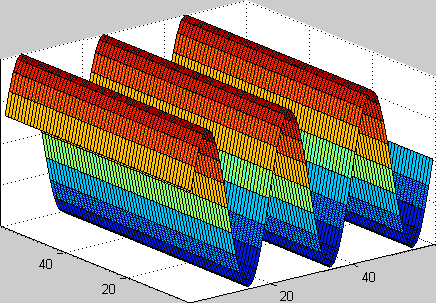
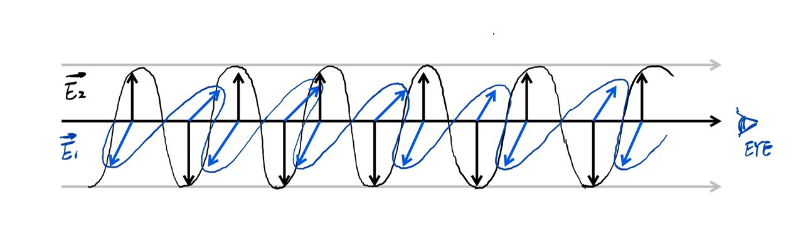
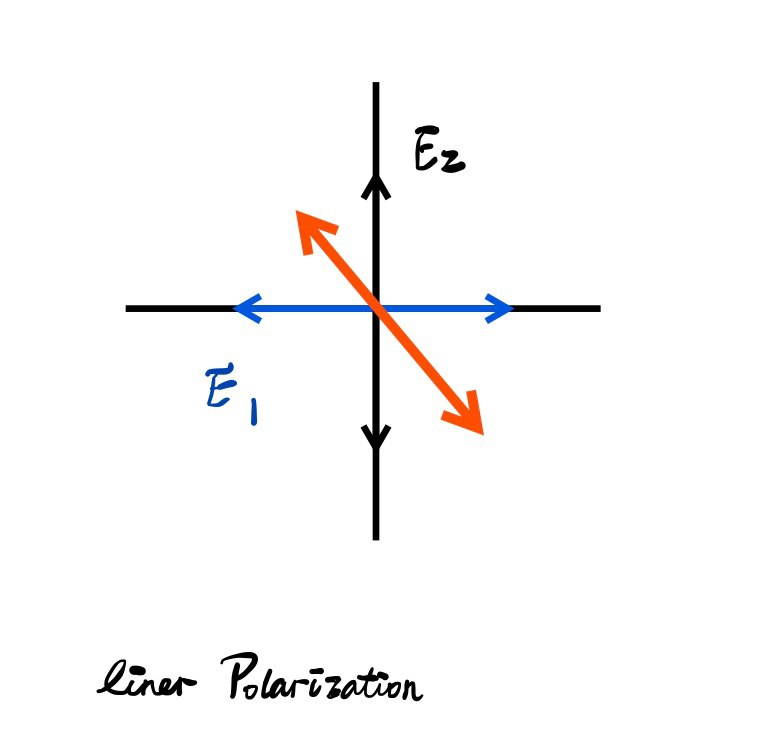
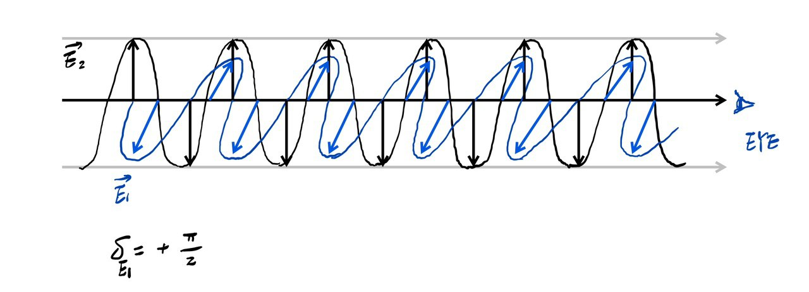
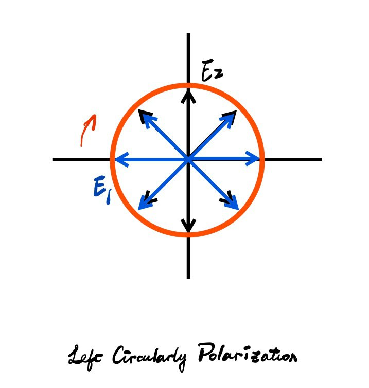

> When reading some papers about [UWB](https://callmemengmeng.github.io/2020/01/01/UWB-Technology/) Antenna, I find that there are some basic knowledges that I can't tell clearly. Thus, it's time to get back to my textbooks for answers.

First of all, what does Polarization mean? Well, Polarization refers to the fact that if a light ray was heading straight toward our eyes or a detector and we are only going to see electric fields either pointing up or down. In other words, a polarized light means light in which the electric fiels is only oscillating in one direction. 
 

Specifically, polarization is an important property of an electromagnetic wave and describes the orientation of the electric field $E$. Generally speaking, the electric field of a wave traveling in one direction may have components in other orthogonal directions and the wave is side to be elliptically polarized.
 

Consider a plane wave[^1] traveling out through the page in the positive $x$ direction, with electric field components in the $y$ and $z$ directions as given by $$E_y=E_Y\sin({\omega}t-{\beta}x)$$ $$E_z=E_Z\sin({\omega}t-{\beta}x+{\delta})$$where $E_Y=$modulus of component accroding to $y$ (constant), $E_Z=$modulus of component accroding to $z$ (constant), $\delta=$phase difference between $E_y$ and $E_z$.
 

The equations above describe two linerly polarized waves which combine vectorially to give the resultant field:
$$\vec{E}=\vec{E_y}+\vec{E_z}$$ 
It follows that $$\vec{E}=\vec{E_Y}\sin({\omega}t-{\beta}x)+\vec{E_Z}\sin({\omega}t-{\beta}x+{\delta})$$ 
At the orign, $x=0$ 
$$E_y=E_Y\sin({\omega}t)$$ $$E_z=E_Z\sin({\omega}t+{\delta})$$ 
then we have 
$$E_z=E_Z[\sin({\omega}t)\cos(\delta)+\cos({\omega}t)\sin(\delta)] \tag{1}$$ 
and thus 
$$\sin({\omega}t)=\frac{E_y}{E_Y} \tag{2}$$ $$\cos({\omega}t)=\sqrt{1-(\frac{E_y}{E_Y})^2} \tag{3}$$ 
Rearranging equation(1) with equation(2) and equation(3) so as to eliminate time yields 
$$(\frac{E_y}{E_Y\sin(\delta)})^2+(\frac{E_z}{E_Z\sin(\delta)})^2-\frac{2E_zE_y\cos(\delta)}{E_ZE_Y\sin(\delta)^2}=1$$ 
it means,
+ **If $E_Y=0$, the wave is linerly polarized in the $z$ direction.**
+ **If $E_Z=0$, the wave is linerly polarized in the $y$ direction.**
+ **If $E_Y=E_Z$, the wave is linerly polarized in a plane at angle of $45^{\circ}$ direction.**
+ **If $E_Y=E_Z$, with $\delta=\pm\frac{\pi}{2}$, the wave is circularly polarized (left circularly polarized for $\delta=+\frac{\pi}{2}$ and right circularly polarized for $\delta=-\frac{\pi}{2}$).**
 

Let's make it more vivid. There is an electric field pointing up marked in blue, then we input another light ray which also has a polarization marked in black. The components are shown in the figure below.

When these lights get into our eyes, we can see one component points up with the other pointing left or one points right with the other pointing down. So the total electric field would point the red line with a certain size according to the Pythagorean theorem.

Now we shift the wave $E_1$ by $\frac{\pi}{2}$ in phase, then the components will be a little different.

When the wave colored in black points down, the wave in blue is zero. As the components travel, the black one decreases while the blue one increases. If our eyes receive these lights as the figure dispics, we are going to see their rotating the polarization in clockwise direction like the axis below. **Consequently, the polarization is right circular if the rotation of the electric field is clockwise with the wave receding and left circular if it is counterclockwise.**

[^1]: A plane wave is a mathematical and nonphysical solution of Maxwell's equations because it supposes an infinite energy, but a spherical wave all the more approaches the structure of the plane wave when it is distant from its point of emission.