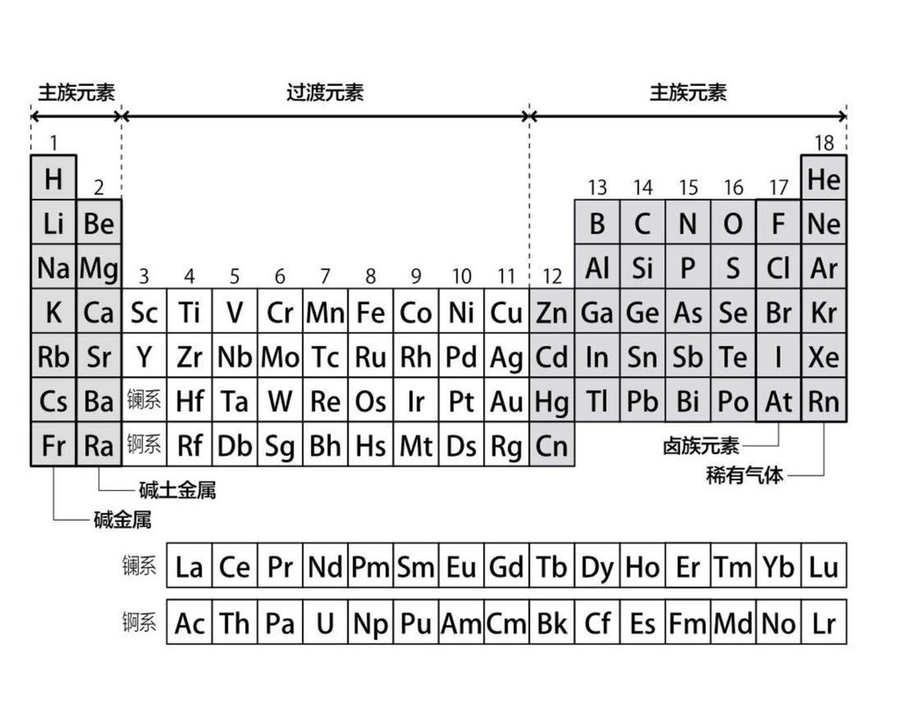

> 最近看书的时候，发现**元素周期表**在中国和日本的族序分类并不完全相同

我们知道，元素周期表共有十八列，每一列都是一个<b>“族”</b>。而所谓的<b>“族”</b>就是
一群性质相似的元素的集合体。在英文中，元素周期表的<b>“族”</b>用的是<b>“group”</b>
这个单词。正所谓<b>主族元素按列看，过渡元素按行看</b>。
 

<u>中日对元素周期表的主族元素、过渡元素以及族的分类有差异。</u>
 

中国定义主族元素为表中1-2列以及13-17列，过渡元素为表中3-10列；元素周期表共16个族，
其中7个主族，7个副族，8-10列为一个族(称为第8族)，而第18列称为0族；日本则定义主族
元素为表中1-2列以及12-18列，过渡元素为表中3-11列，共计18个族，即每一列为一族。
