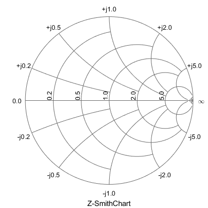
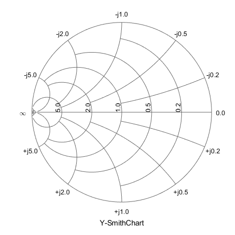
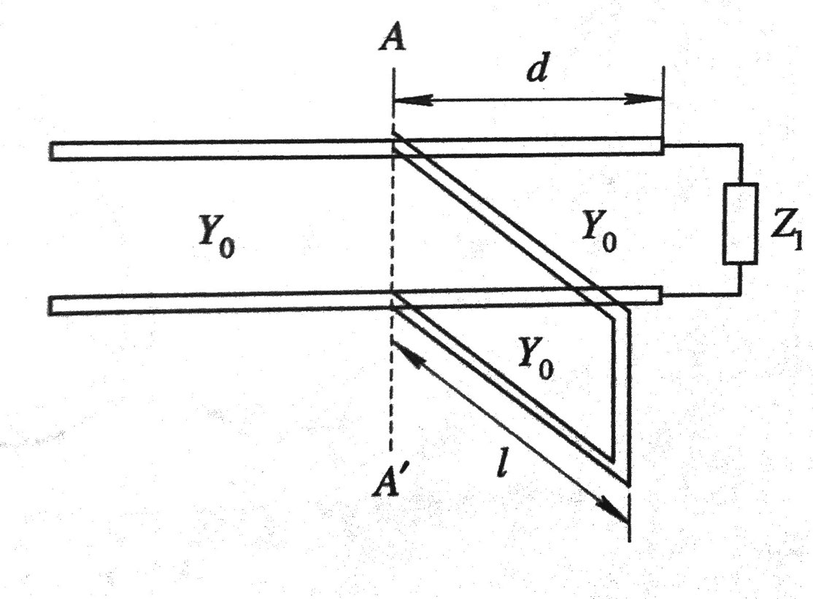

> 史密斯圆图(SmithChart)是一个分析工具，可以在一个图中直观显示传输线的特性阻抗$Z_0$和反射系数$\Gamma(z)$，是传输线阻抗匹配分析的有效方法。最近翻阅《微波技术基础》时看到两道习题，分别涉及使用圆图法和计算法对串并联单支节进行匹配。遂将圆图法阻抗匹配分析思路整理如下。

## SmithChart基础回顾

“在我能够使用计算尺的时候，我对以图表方式来表达数学上的关联很有兴趣。”——Philip Hagar Smith

就在德军进攻波兰“引爆”第二次世界大战的那一年，[菲利普·史密斯](http://smithchart.org/phsmith.shtml)先生发明了惠及后世射频领域的利器——SmithChart[^1]。其中阻抗圆图方程由反射系数和归一化阻抗之间的关系推导而出。
直角坐标形式的反射系数：
$$\Gamma(z)=\Gamma_u+\jmath\Gamma_v$$
传输线上任一点归一化阻抗为：
$$\bar{z_{in}}=\frac{Z_{in}}{Z_0}=\frac{1+\Gamma(z)}{1-\Gamma(z)}$$
令$\bar{z_{in}}=r+\jmath x$，整理上式可得：
$$(\Gamma_u-\frac{r}{1+r})^2+\Gamma_v^2=(\frac{1}{1+r})^2$$
$$(\Gamma_u-1)^2+(\Gamma_v-\frac{1}{x})^2=(\frac{1}{x})^2$$
即以归一化电阻$r$和归一化电抗$x$为参数的两组圆方程——表示归一化电阻圆和归一化电抗圆。得到阻抗圆图后，根据无耗传输线的$\frac{\lambda}{4}$阻抗变换性质，将之顺时针旋转$\pi$即可得到导纳圆图。

### 阻抗原图的基本特点

1. 圆图旋转一周为$\frac{\lambda}{2}$；
2. 实轴左端点为短路点$(r,x)=(0,0)$，右端点为开路点$(r,x)=(\infty,0)$，中心点为匹配点$\bar{z_{in}}=1+\jmath0$；
3. 阻抗原图内上半圆内的电抗$x>0$呈感性，下半圆内的电抗$x<0$呈容性；
4. 实轴上的点表示纯电阻点，左半轴上的点是电压波节点，其上的刻度既表示$r_{min}$又代表行波系数$K$，右半轴上的点是电压波腹点，其上的刻度既表示$r_{max}$又代表驻波比$\rho$；
5. 传输线上由负载向电源移动时，在圆图上应该顺时针旋转；反之，由电源向负载移动时，逆时针旋转；
6. $\left| \Gamma \right|=1$的圆周上的点代表纯电抗点。

### 导纳圆图的基本特点

1. 圆图旋转一周为$\frac{\lambda}{2}$；
2. 实轴左端点为开路点$(g,b)=(0,0)$，右端点为短路点$(g,b)=(\infty,0)$，中心点为匹配点$\bar{y_{in}}=1+\jmath0$；
3. 阻抗原图内上半圆内的电纳$b>0$呈容性，下半圆内的电纳$b<0$呈感性；
4. 实轴上的点表示纯电导点，左半轴上的点是电压波腹点，其上的刻度既表示$y_{min}$又代表驻波比$\rho$，右半轴上的点是电压波节点，其上的刻度既表示$y_{max}$又代表行波系数$K$；
5. 传输线上由负载向电源移动时，在圆图上应该顺时针旋转；反之，由电源向负载移动时，逆时针旋转；
6. $\left| \Gamma \right|=1$的圆周上的点代表纯电纳点。

## SmithChart识图方法

利用SmithChart做图设计匹配网络时，串联元件应基于归一化阻抗确定，并联元件应基于归一化导纳确定。具体识图步骤可按如下步骤：
+ 确定负载的归一化阻抗并确定它在圆图上的位置；
+ 画出等反射系数圆。若短截线需要并联连接，则确定其导纳值及其在导纳圆图上的位置；如果短截线需要串联连接，则维持在归一化阻抗点；
+ 前面已经找到了归一化阻抗(导纳)点，沿着等反射系数模圆向着信号源的方向(顺时针)移动，和匹配圆交于两点A、B。从负载到交点的距离为$d_s$。可在任一点放置匹配元件；
+ 若在上一步中的导纳是$1\pm\jmath b$，为了匹配需要并联电纳$\mp\jmath b$。它可以是分立元件(根据电纳值的正负判断电容或电感)，也可以是一段短截线；
+ 若是短截线，需要确定支节长度。由于短截线的另一端是开路或短路，线上的驻波比将是无穷大，可以用圆图最外边的圆表示这一情况。在圆图上确定所需要的电纳点$\mp\jmath b$位置，然后向负载方向移动(逆时针)到开路点(零电纳)或短路点(无穷大电纳)被找到。移动距离等于短截线的长度$l_s$；
+ 对于串联电抗元件，前面两步相同，只要用归一化阻抗代替归一化导纳即可。

## SmithChart串联单支节阻抗匹配实例

### 题目条件

一均匀无耗传输线的特性阻抗为$70\Omega$，负载阻抗为$Z_l=70+\jmath140\Omega$，工作波长$\lambda=20cm$。使用Smith圆图法设计串联短路支节匹配器的位置和长度。

### 图像分析

#### 归一化处理

条件中给出了特性阻抗和负载阻抗，首先对负载阻抗归一化，得到：
$$\bar{z_l}=\frac{Z_l}{Z_0}=\frac{70+\jmath140\Omega}{70\Omega}=1+\jmath2$$在图上标为$P_1$点，其电长度为$l_{P_1}=0.187\lambda$，反射系数为：
$$\Gamma_l=\frac{\bar{z_l}-1}{\bar{z_l}+1}=\frac{\jmath}{1+\jmath}=\frac{\sqrt{2}}{2}e^{\jmath\frac{\pi}{4}}$$

#### 与匹配圆的交点

由于短截线串联接入，将归一化阻抗点$P_1$沿着等$\left| \Gamma \right|$圆顺时针旋转，与$r=1$电阻匹配圆交于$A$、$B$两点(其中$A$点与$P_1$点重合)。在图中可以读出：
$$\bar{z_A}=1+\jmath2, 电长度l_A=0.187\lambda$$ $$\bar{z_B}=1-\jmath2, 电长度l_B=0.315\lambda$$

#### 支节离负载的位置

支节离负载的位置，即从负载$P_1$点到交点$A$、$B$的电长度之差：
$$d_1=l_A-l_{P_1}=0.187\lambda-0.187\lambda=0$$ $$d_2=l_B-l_{P_1}=0.315\lambda-0.187\lambda=0.128\lambda$$

#### 短路支节的长度

为了实现负载匹配，短路支节对应的归一化阻抗为$\bar{z_1}=-\jmath2, \bar{z_2}=\jmath2$。由于短路支节的负载为短路，对应阻抗圆图的左端点，将短路点顺时针旋转至单位圆与$x=-2, x=2$的交点，旋转长度即为短路支节的长度：
$$l_1=0.324\lambda, l_2=0.176\lambda$$

#### 数据计算

条件中给出了波长$\lambda=20cm$，代入上式可得两组解：
$$\begin{cases}
d_1=0, & l_1=0.324\lambda=6.48cm \\\\
d_2=0.128\lambda=2.56cm, & l_2=0.176\lambda=3.52cm \\\\
\end{cases}$$

## SmithChart并联单支节阻抗匹配实例

### 题目条件

特性阻抗为$50\Omega$的无耗传输线，终端接阻抗为$Z_l=25+\jmath75\Omega$的负载，采用短路单支节匹配，使用Smith圆图法求支节的位置和长度。

### 图像分析

#### 归一化处理

条件中给定了特性阻抗和负载阻抗，首先归一化负载阻抗$\bar{z_l}=\frac{Z_l}{Z_0}=0.5+\jmath1.5$，在导纳圆图中标为$P_1$点，相应的归一化导纳为$\bar{y_l}=\frac{1}{\bar{z_l}}=0.2-\jmath0.6$，标为$P_2$点，从图上可以读出对应的向电源(顺时针)方向的电长度为$0.412\lambda$。

#### 与匹配圆的交点

短截线并联接入，将归一化的导纳点$P_2$沿等$\left| \Gamma \right|$圆顺时针旋转，与$g=1$电导匹配圆交于$A$、$B$两点。在图中可以读出：
$$\bar{y_A}=1+\jmath2.2, 电长度l_A=0.192\lambda$$ $$\bar{y_B}=1-\jmath2.2, 电长度l_B=0.308\lambda$$

#### 支节离负载的位置

支节离负载的位置，即从负载导纳点$P_2$点到交点$A$、$B$的电长度之差($P_2$点要先转回开路点，再出发转到$A$、$B$点)：
$$d_1=l_A+0.5\lambda-l_{P_2}=0.192\lambda+0.5\lambda-0.412\lambda=0.28\lambda$$ $$d_2=l_B+0.5\lambda-l_{P_2}=0.308\lambda+0.5\lambda-0.412\lambda=0.396\lambda$$

#### 短路支节的长度

为实现负载匹配，短路支节对应的归一化导纳为$\bar{y_1}=-\jmath2.2,\bar{y_2}=\jmath2.2$。由于短路支节的负载为短路，对应导纳圆图的右端点，将短路点顺时针旋转至单位圆与$b=-2.2,b=2.2$的交点，旋转长度即为短路支节的长度：
$$l_1=0.318\lambda-0.25\lambda, l_2=0.182\lambda+0.25\lambda$$

#### 数据计算

整理可得两组解：
$$\begin{cases}
d_1=0.28\lambda, & l_1=0.068\lambda \\\\
d_2=0.396\lambda, & l_2=0.432\lambda \\\\
\end{cases}$$

[^1]: [此链接提供下载SmithChart.pdf](https://www.acs.psu.edu/drussell/Demos/SWR/SmithChart.pdf)