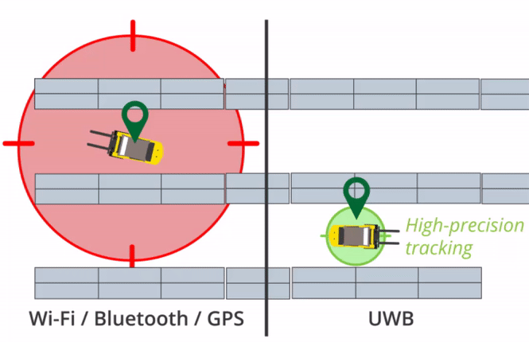

# UWB Technology

## Intruction
**UWB**, aka. **u**ltra **w**ideban**d**, is a radio communications technology for the transmission of signals over a very broad range of frequencies, typically using very low-energy pulses with a duration of a nanosecond or less.

This technology generally consists of high bandwidth and most of the time personal area networks are involved with such technology. All the operations of the UWB technology work wirelessly. The processes for which the ultra wide band technology is designed are the multimedia processes. The old or the traditional devices on which UWB technology is applicable are the radar system etc.

## How UWB Technology Works[^1]
The working of the UWB technology is very specific and calculated because it generally governs the working of those processes in which multimedia processes are involved for example MP3 players, MP4, different type of mobile phones in which PDA[^2] technology is involved. UWB technology can be applicable on the places where the distance is shorter and needs transmission of higher speed.

This technology is completely depends upon the radio waves and that is why it is sometimes called as UWB radio transmiter. The UWB technology starts its working when the radio waves from the transmiter emit and send short signals as to the spectrum. These signals are in such a way they move around the actual setting such as if the centre point is set on $6GHz$ then it will move around $5GHz$ or $7GHz$. Consequently, UWB technology provides high speed data transfer wirelessly between two places but it only operates on some meters. If the UWB was used in large distance communication, it will not work or drop datas during transmission.

## Advantages and Disadvantages of UWB technology[^3]

### Advantages of using UWB technology
Accoring to the previous description, we can conclude some advantages of UWB technology as follows: 
1. With this technology we can transfer more data at low power.
2. Good noise immunity.
3. Signals can penetrate variety of materials easily.
4. High immunity to [multipath fading](http://www.wirelesscommunication.nl/reference/chaptr03/fading/fading.htm).
5. Potentially very high data rates.

### Disadvantages of UWB technology
As we know, nothing interesting is ever completely one-sided. Here comes the disadvantages of UWB technology: 
1. Higher cost.
2. Slower adoption rate.
3. Long signal accquisition times.
4. [FCC](https://www.fcc.gov/) has limited emission requirements which is less than $0.5mWatt$ and max power over $7.5GHz$ band.

## Applications of UWB technology
There are numbers of applications of the ultra wideband technology but most of them are of the indoor appliances or the devices that operates on the small distances. In this scenario can UWB enhance the speed of data transmission between the applications. 
1. Wireless technologies such as monitors, wireless printers, attach different type of devices with the help of wireless media to the computer system.
2. RADAR is also an important application of the UWB technology. Generally this technology is used in those radar systems that are used to detect the presence of the people under the ground or behind the walls. Basically they are useful for the rescue teams. It also used in repairing of industries by detecting the materials like steel or wiring etc in the walls or in the ground. Generally such radar systems are called as ground penetrating radar GPR.
3. In the engineering field UWB is used to measure the accurate distances between the points and locate the actual position of the working. In this case UWB work in both circumstances such as indoor and outdoor. Such position applications of the ultra wide technology can also used as security and for navigation purposes.

[^1]: **Artical reference:** admin.[What is UWB technology](http://wifinotes.com/)[EB/OL].http://wifinotes.com/,2015-3-26.

[^2]: PDA, aka. a **Personal Digital Assistant** or a **handheld PC**, is a variety mobile device which functions as a personal information manager. However, PDAs have been mostly displaced by the widespread adoption of highly capable smartphones.

[^3]: **Artical reference:** RF wireless world.Advantages and disadvantages of ultra wide band technology[EB/OL].https://www.rfwireless-world.com/Terminology/Advantages-and-disadvantages-of-UWB.html,2012. 