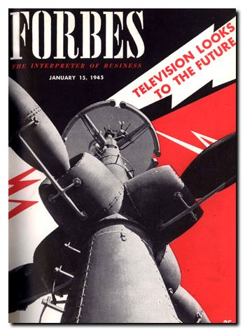

> 最近一段时间都在查阅有关UWB天线技术的文献书籍，偶得[Hans Schantz](http://aetherczar.com/)博士的大作*《The Art and Science of Ultrawideband Antenna》*，了解到天线技术发展的脉络，以及撑起这片天的前辈们，遂摘录整理如下。

<b><i>James Clerk Maxwell《电报传递的爱情诗》</i></b>

<i>虽然我和你远隔万里，</i>

<i>但我们的思绪交织在一起。</i>

<i>就像电流计的回路和指针那样，</i>

<i>你的思绪始终萦绕在我的心间。</i>

<i>像丹尼尔一样永恒，像格罗夫一般强壮，</i>

<i>又像斯米那样热情奔放，</i>

<i>我心中涌出爱情的潮水，</i>

<i>它们又都流到你的身边。</i>

<i>啊！请告诉我，</i>

<i>当电文从我心头发出，在你身上感生出什么样的电流？</i>

<i>你咔哒一声就会消除我的苦恼。</i>

<i>韦伯穿过一个又一个的欧姆，</i>

<i>把回音带给我，——</i>

<i>“我是你忠实而又真诚的法拉，</i>

<i>充电到一个伏特，表示对你的爱。”</i>

## 天线的历史

就在大清帝国和法兰西帝国打完仗后的第四个年头，[赫兹先生](https://baike.baidu.com/item/%E6%B5%B7%E5%9B%A0%E9%87%8C%E5%B8%8C%C2%B7%E9%B2%81%E9%81%93%E5%A4%AB%C2%B7%E8%B5%AB%E5%85%B9/2125965)于一八八八年首次证实了电磁波的存在[^1]。十余年后，无线电通信诞生，这种最简单的早期无线电正是现代超宽带无线通信的老祖宗。换言之，超宽带天线的起源要从天线技术的历史谈起。

今之视昔，早期的无线电设备可谓是十分简陋。由于缺少实用化的能产生某种频率的连续信号波形的装置，无线电技术的先驱们只得借助谐振回路充放电的现象实现通信，而这套简陋设备辐射的就是阻尼衰减的正弦脉冲，也可以算得上是“超宽带”系统。

这种通信方式利用火花放电间隙产生的振荡脉冲实现，其中阻尼正弦脉冲发射机的出现并非是经过严格设计得到，而完全出于偶然。有趣的是，发射这种超宽带信号，完全与出于某种意图而故意进行的扩谱技术无关；相反地，超宽带脉冲是在射频情况下产生正弦波时不可避免出现的某种“副产品”。宽带信号其实和先驱们预期想要的窄带特性背道而驰。“窄带”的思想，最早体现在1892年克鲁克斯先生[^2]的著作中：
 

“任意两个居住在接收设备灵敏度最大半径范围内的朋友，首先商定好他们所用的特定工作波长，以便他们的接收设备能调谐到相应的频率上，相互接收到对方的信号，这样就可以随心所欲地通过控制脉冲持续的时间长短、发送莫尔斯码长短号，实现他们之间的通信。”
 
虽然“窄带工作”是先驱们的目标，然而他们的实验却是从辐射超宽带阻尼脉冲信号开始的。正因如此，那些用于收发电报脉冲信号的早期天线，在今天的超宽带通信中依然适用，这一点完全是不足为奇的。

## 先驱者用火花点亮时代

“我已经成功产生了电具有的独特射线，并利用它们完成了一系列基本实验——这些实验以往都是对光和辐射热而展开的。”<b>——海恩里克·赫兹</b>

### 海恩里克·赫兹

赫兹先生并非第一个产生电磁波的人，他被冠以“电磁波的发现者”之称完全因为他是第一个故意产生电磁波并测量其速度，引入电磁波的“反射”、“折射”、“绕射”等概念，并试图以此证明他所发现的是一种频率比光低得多、波长远长于光的“光波”的人。赫兹知道他使用的谐振回路中的电感$L$和电容$C$的大小，采用下式计算电磁波的谐振频率$$f=\frac{1}{2\pi\sqrt{LC}}$$测得波长$\lambda$，又已知频率$f$，赫兹就能估计出他用谐振回路产生的信号速率$$v=\lambda f$$赫兹设计了一个带有可调螺丝窄间隙的环状谐振天线来实现电磁波的检测器。通过观察放电的强度以及已知的间隙距离，赫兹就能粗略估计出接收场强的强度，同时他也引入了反射器，以使得射频能量更加集中和汇聚。所有赫兹的天线设计中，真正称得上是“超宽带”的只有抛物柱面反射器(虽然赫兹的反射器天线实际上只用到了相对较窄的带宽)。

赫兹先生是天线与射频技术的先驱，他的成就中还蕴藏着更为深远的含义。皇家铸币厂的艾厂长[^3]曾经曰过，某一位置上的物体会在一定距离以外的位置产生影响，这种作用无需穿越任何插入其中的媒质[^4]。[迈克尔·法拉第](https://baike.baidu.com/item/%E8%BF%88%E5%85%8B%E5%B0%94%C2%B7%E6%B3%95%E6%8B%89%E7%AC%AC)提出的“**场**”的概念就是对这种教条的挑战，他认为“场”以电和磁的形式弥漫在整个空间中，从而对外产生影响。作为法拉第先生的后继，[麦克斯韦](https://baike.baidu.com/item/%E8%A9%B9%E5%A7%86%E6%96%AF%C2%B7%E5%85%8B%E6%8B%89%E5%85%8B%C2%B7%E9%BA%A6%E5%85%8B%E6%96%AF%E9%9F%A6/314955?fromtitle=%E9%BA%A6%E5%85%8B%E6%96%AF%E9%9F%A6&fromid=161423)的理论很大一部分的目的就是为了给出法拉第这个概念的数学基础，而赫兹和他的天线则为麦克斯韦、法拉第的正确理论提供了首次实验证明。

### 奥利弗·洛奇

如果说赫兹是电磁波领域第一个吃“螃蟹”的人，那么白胡子洛奇先生离这只螃蟹只有半步之遥却失之交臂。洛奇先生是一名兼具理论与动手天赋的学者，对避雷针的原理做出显著贡献，他与[奥利弗·亥维赛](https://baike.baidu.com/item/%E5%A5%A5%E5%88%A9%E5%BC%97%C2%B7%E4%BA%A5%E7%BB%B4%E8%B5%9B)[^5]一样，都是交流电路与电抗理论发展的主要贡献者。就在赫兹发表*《Electric Waves: Being Researches on the Propagation of Electric Action With Finite Velocity Through Space.》*的同一年，一位从阿尔卑斯度假回来的学者正兴冲冲乘坐刚驶出利物浦的火车，计划在英国科学促进协会的一次会议上汇报自己的研究成果——足够的能量下导线周围的空气可以被电离[^6]。洛奇也完成了电磁波的实验测量，但他承认赫兹是首个发现自由空间中电磁波的人。

在[马可尼](#GM)取得成功的激励下，洛奇开发出首套实用的谐振式无线电系统，也就是收发信机都能调谐到一个频率上，以获得最大的接收信号。1898年洛奇获得了谐振式无线电系统的专利，这项窄带无线电的专利却也推出了首个“超宽带天线”，正如他在论文[^7]中所述：
 

“作为带电表面或电容区域，球体、方板或者其他金属表面都是可以采用的；但我认为，为了同时得到较低的电阻和大的静电容，可以采用锥形、三角形、其他具有公共连接点且表面朝外伸展的发散状表面，或具有接地面的单个绝缘表面(“地”可以是真的大地，或者埋入大地的金属板)。”
 
简言之，洛奇推出了球状偶极子、方板偶极子、双锥偶极子，同时提出了采用接地板的单极子天线的概念。

### Jagadis Chandra Bose

在大清正和法国人打得不可开交之时，Bose已经用电磁波实现了遥控振铃和火药引爆。一八九七年，[瑞利男爵](https://www.britannica.com/biography/John-William-Strutt-3rd-Baron-Rayleigh)(就是提出瑞利散射、发现氩气、接手麦克斯韦担任卡文迪许实验室主任的奇人)邀请Bose到伦敦皇家学会展示他的成果。Bose展示了他的全套$60GHz$无线电收发系统，当中就包括Bose本人戏称为“漏斗”的首个喇叭天线，采用火花放电间隙作为发射器，使用半导体结作为接收器。

### G·马可尼

<b>马可尼</b>是真正实现无线通信的先驱之一，其他人(包括洛奇)虽然展示了通过无线电波可以传输信号，但是他们在将这项技术商业应用方面却落后了。马可尼曾确信无线电的应用价值：
 

“倘若我们永远局限于仅仅把光的来源归根于‘点蜡烛’，那么我们也许永远不会建造灯塔和反射器。”
 
马可尼发现，良好的接地重要且价值巨大。他选取了比赫兹低得多的工作频率，集中研究大功率、更长距离的系统，并设计了扇状和单锥状天线。随后马可尼和其他合作者继续改进无线电技术，他们摆脱了火花间隙装置的局限，改而设计实现连续波系统。有效的窄带发射机带来尺寸小巧、成本低廉的细线天线和环状天线，很快便使得洛奇、Bose等先驱者发明的宽带天线黯然失色，这些早期发明的宽带天线逐渐被人抛诸脑后。

## 短波时代的天线

经过火花间隙时代的先驱们开疆扩土，时间来到二十世纪三十年代，正值资本主义经济危机、思潮鼎立多元鸣放之际，无线电科学的上限频率突破了$30MHz$的界限，为了传输比$10KHz$带宽的商用调幅(AM)广播信号更为复杂的信号，自然就会对天线提出更高的要求，宽带天线的设计备受瞩目。大致梳理短波时代的天线发展脉络：
+ 1933年，埃德温·霍华德·阿姆斯特朗发明了采用$150KHz$或者更宽带宽的调频(FM)技术；
+ 1939年，菲利普·卡特重提双锥和单锥天线用途，在洛奇的基础上进行改进，提出渐变馈电的方法；
+ 1939年，尼尔斯·林登布拉德发明同轴角锥单元天线，改进了套筒式偶极子天线的设计思想，加装一个渐变阻抗变换装置使得天线的带宽更宽。这种天线可以说是整个电视时代研究成果的象征享有盛名，以致于它也许是至今唯一一个有幸出现在主流杂志《福布斯》封面上的天线；

+ 1941年，S·谢昆诺夫研究了球状偶极子的设计，提出凡是比较“胖”、粗的天线都具有相对较低的电抗储能，从而比一般的细天线具有更宽的带宽特性。“‘胖’粗者佳”成为超宽带天线设计的一个基本原则为人所知；
+ 二十世纪四十年代，阿尔奇·金设计了圆锥喇叭天线，马丁·凯特恩泽发明了角锥喇叭天线。A·Kandoian提出了双锥天线的一种改进形式——用金属盘取代其中一个锥体从而获得多倍频的阻抗带宽。当微波技术发展赶上以Bose为先驱的毫米波技术时，他的“漏斗”天线被后继者独立地重拾起来；
+ 二十世纪五十年代，一大堆各种形式的“球形”天线涌现，谢昆诺夫与弗里斯在这一时期设计了“泪滴”双锥天线，减少传统双锥天线渐变结构处出现突变而产生的反射。

## 之后发生的故事

火花间隙时代和短波电视时代界限分明，但近代无线电时代发展具有太多重叠特性已无法分辨。

二十世纪五十年代，在乔治·布朗和伍德沃德的设计中，洛奇发明的“蝴蝶结”形天线再次焕发活力，兰伯特则让马可尼的方板天线复苏并用于微波通信。维克多·拉姆塞指出宽带天线设计中的一大核心原则——**等角原理**：
 

“只要天线的形状仅仅是角度的函数，那么它的阻抗与方向图特性都与频率无关。”
 
在这一原理指导下，又发展出螺旋天线、对数周期天线、圆锥等角天线等一系列非频变天线。在苏联解体后的第三个年头，迈克·托马斯和罗纳德·沃尔森引入了连续渐变的圆偶极子天线，表现出优异匹配特性和良好性能。超宽带天线日益发展。

2002年，FCC提出了分配$3.1$~$10.6GHz$作为超宽带通信的频段。

[^1]: Heinrich Hertz, German, "*Electric Waves: Being Researches on the Propagation of Electric Action With Finite Velocity Through Space.*"
[^2]: Crooks William, England, "*Some Possibilities of Electricity.*"
[^3]: 此处指艾萨克·牛顿，于一六九六年走马上任皇家铸币厂监管。
[^4]: 牛顿爷是否亲口说过这句话还有待进一步考证。
[^5]: 亥维赛有名言传世，"Logic can be patient for it is eternal."
[^6]: 这个例证，和赫兹发表的论文论证同一个现象。
[^7]: Lodge Oliver, U.S., "*Electric Telegraphy.*"