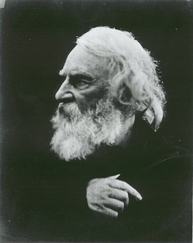

在复习英语时，发现[亨利·沃兹沃思·朗费罗(Herry Wadsworth Longfellow, 1807~1882)](https://zh.wikipedia.org/zh-hans/%E4%BA%A8%E5%88%A9%C2%B7%E6%B2%83%E8%8C%B2%E6%B2%83%E6%80%9D%C2%B7%E6%9C%97%E8%B2%BB%E7%BE%85)的一首诗歌**《雪花》**用到了完全倒装语法，现摘录如下：
> 

<b>Snowflakes</b> 
<u>by Herry Wadsworth Longfellow</u>  
Out of the bosom of the Air, 
Out of the cloud-folds of her garments shaken, 
Over the woodlands brown and bare, 
Over the harvest-fields forsaken, 
Silent, and soft, and slow 
Descends the snow.[^1]  
Even as our cloudy fancies take 
Suddenly shape in some divine expression, 
Even as the troubled heart doth make 
in the white countenance confession, 
The troubled sky reveals the grief it feels.  
This is the poem of the air, 
Slowly in the silent syllables recorded, 
This is the secret of despair, 
Long in its cloudy bosom hoarded, 
now whispered and revealed 
to wood and field.

 

 
译制为中文后大意如下，
> 

<b>雪&nbsp;&nbsp;&nbsp;&nbsp;花</b> 
<u>亨利·沃兹沃思·朗费罗&nbsp;作</u>  
挣脱苍天的怀抱 
冲出她摇摆的云蝶衣衫 
飘过棕色赤裸的林地 
飞跃到收割后的麦田 
悄悄地，轻轻地，慢慢地 
雪花飘落  
这仿佛是我朦胧的幻想 
突然变为神圣的表达 
也仿佛心中的惆怅 
呈现在我们苍白的脸上 
就正如烦恼的天空 
流露出她所感受的忧伤  
这是苍穹的诗篇 
以无声的音符铭记 
缓缓飘向人间 
这是绝望的秘密 
以默默的方式收藏 
就正对着森林和田野 
倾诉宣泄

[^1]: 第一小节中的主语应该是<b>"snowflakes"</b>。
