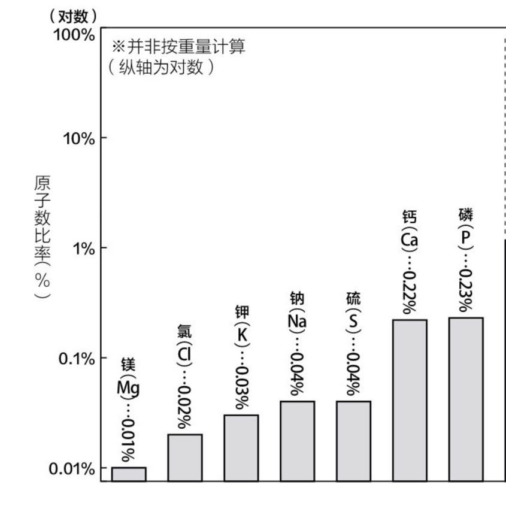

> 七月份的鹰城犹如蒸笼，正是烈日炎炎似火烧。暑假在家的我好似趴窝的老母鸡，缩在家中不愿动弹，也懒得外出受那三足金乌的炙烤。一日午后水足饭饱，把自己舒服地摆在地板上又顺手抄起小妹的初三化学课本，粗略翻阅以求尽快入眠。在种种变量的作用下，无意翻到讲人体内元素含量的部分，初中课本只给出人体含量最多的四种元素：**"氧(O)、碳(C)、氢(H)、氮(N)"**[^1]。但这只是构成人体的宏量元素，人体内的少量元素同样至关重要。

## 人体少量元素含量榜
如果让少量元素们按照在人体中所占原子数量的多寡排排队(如同幼儿园小盆友按照高低个儿排队做操那般)的话，那么这只队伍就应该是这样子的。 

## 组成人体的少量元素

### 磷(P)和钙(Ga)
生活经验告诉我们磷常被人类用作肥料与火柴，然而造物主也用磷制造包括人类在内的生物体。 
磷用作肥料[(磷素肥料)](https://baike.baidu.com/item/%E7%A3%B7%E8%82%A5)的原因之一是磷元素是植物叶部和莖部绿色部分不可或缺的养分，合理施用磷肥，可增加作物产量改善作物品质。需要注意的是，植物只吸收包括$\(H_2PO_4)^-，(HPO_4)^{2-}，(PO_4)^{3-}$等離子態磷酸根。磷肥的種類分為無機態磷肥和有機態磷肥。無機態磷肥依其溶解特性可分為水溶性磷酸肥料和檸檬酸銨溶性磷酸肥料。有機態磷肥則包括米糠和豆餅類的有機磷酸鹽。 
我们之所以用磷做火柴，是因为磷的燃点较低，白磷的燃点甚至只有$40℃$。也正是这个原因，土葬的尸体分解后释放出体内的磷，被自然界中的放电现象“引燃”后形成了活跃于中国各种志怪故事中的“鬼火”~~(果然是取之于民而用之于民呐，咳咳，有点扯远了...)~~。其实大多数生物细胞都离不开磷，高中知识告诉我们，细胞是生命活动的基本单位。那么DNA便是这一基本单位的设计图纸，DNA中含有磷酸，没有了磷细胞也无法分裂，生命自然无法传承给下一代。 
含有钙元素的一些化合物构成了生物体的骨骼和牙齿，但其实磷也是骨骼和牙齿的原材料。骨骼和牙齿的主要成分是一种叫做**“羟基[^2]磷灰石”**的磷酸钙化合物。其分子式为$Ca_{10}(PO_4)_6(OH)_2$，其中钙与磷的原子数量比例是10:6，你看看你看看，磷元素的含量还是相当多滴。

### 硫(S)
我对硫的好感早已被臭鸡蛋味道的$H_2S$毁坏殆尽。其实人体的必须氨基酸之一甲硫氨酸中就含有硫。除此之外，皮肤头发和指甲的主要成分角蛋白中也有硫。说到这里，我们的毛发有一定的弹性，稍微用力拉扯也不会断掉，这是由于硫原子紧密相连，维持毛发的的强度。没有了硫，毛发会变得特别脆，稍微碰一下便成为齑粉。

### 钠(Na)和钾(K)
生物体肌肉和神经的正常工作离不开钠钾这两种元素，它们在人体内均以[正一价](https://baike.baidu.com/item/%E5%8C%96%E5%90%88%E4%BB%B7)阳离子存在，只有阴离子才可以中和它，正因如此，排名第十[^3]的就是以阴离子存在于体内的氯。

### 氯(Cl)
我们的大脑中有一种“GABA能神经元”的神经细胞，它会利用一种叫做“GABA”的神经递质来传导信息。这种神经元一旦兴奋，大脑的活动就会趋于平静，外部生理反应为犯困。这一机理是怎么实现的呢？ 
我喜欢称能使大脑亢奋的神经元为“兴奋神经元”，它们的膜上有一些能让氯离子通过的小孔，但这些孔平常处于关闭状态，所以人体内大量的氯离子并不能随意进入细胞。但当“GABA能神经元”被激活后，小孔就会开启，氯离子可以大量进入细胞内部。如此一来，大脑不容易亢奋，人也就产生困意。 

### 镁(Mg)
人体内的镁有60%存在于骨骼之中。要想强健骨骼，钙镁必须同时摄入，其最理想的比例是在摄入两份钙的同时摄入一份镁。钙与镁的比例一旦失衡，骨密度就会下降，患上心肌梗塞、心绞痛的风险也会直线上升。

[^1]: 这里是按[元素占细胞鲜重百分比的大小](https://baike.baidu.com/item/%E4%BA%BA%E4%BD%93%E5%85%83%E7%B4%A0/6225128)排序。
[^2]: 羟基是极性基团,与水可形成氢键,在无机化合物水溶液中以带负电荷的离子形式存在($-OH$)。
[^3]: 这里是指人体内所有元素的总排名。