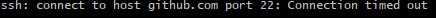
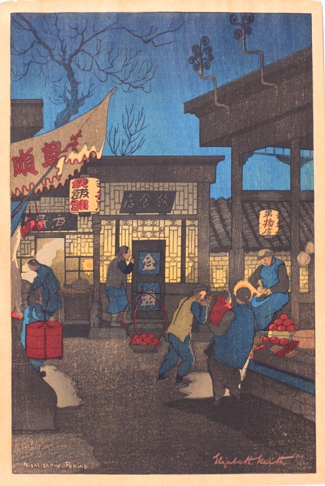

> 古人抚琴也称弄琴，久而久之，这曲文的一章便被称为一弄，三章便是三弄。所谓“**梅花一弄断人肠，梅花二弄费思量，梅花三弄风波起，云烟深处水茫茫。**”是为梅花三弄。今儿个正月十五，农历新年即将翻篇儿，二零二零年还剩百分之九十。年关饭菜油水大又少运动睡不着，啰嗦三件事儿作为元宵三弄吧。

## 八阿哥
上午忙着赶工扫尾天线仿真练习，眼巴前儿将代码拾掇好就准备入库，结果八阿哥突然跳出来说：滚！

明明前几天更博客还能用[Git](https://git-scm.com/downloads)上传拉取文件，这怎么说不行就不行了呢？



我又问：`$ ssh -T git@github.com`?
八阿哥答：`$ ssh: connect to host github.com port 22: Connection timed out`!!!

得，咱不知道怎么冒犯到八阿哥了，不把这位爷摆平就甭想着入库。上网查吧，看看八阿哥骂回来的这句话咩意思，哦，是说链接[Github](https://github.com/)相应端口时出错，合着是找不着门了。有原因就能使手段从中斡旋，有两种方法：
+ 克隆项目时使用`git clone https://xxxxxxx`来代替`git clone git@github.com/xxxxx`，但是后面每次使用都得输密码；
+ 在id_rsa同级目录下新建config.txt文件，并写入代码：```
Host github.com
User YourEmail@163.com
Hostname ssh.github.com
PreferredAuthentications publickey
IdentityFile ~/.ssh/id_rsa
Port 443
```

前者是换个腿脚快嘴巴甜的家丁再探，后者是塞点儿“私货”铺铺路。自古以来讲求礼尚往来和气生财，大饼卷米饭就白馍，我得把这位爷伺候好喽。话不多说，直接送文档。

再次询问：`$ ssh -T git@github.com`?
八阿哥答：`$ Hi, ! You've successfully authenticated, but GitHub does not provide shell access.`

小的叩送八阿哥！

## 元宵节

元宵节，也称上元节，拆开来看，元乃元月，宵为夜晚，合起来这叫新年的第一个月圆之夜。人好稀罕稀罕的物什儿，凡穿上“第一次”、“第一个”之类的黄马褂，平时再平凡的玩意立马变得主贵[^1]起来。月亮圆缺更迭虽是天体现象，但既然是一年中头一次月圆，重要性自然不容小觑。勤劳的中华民族为每一个传统节日精心准备了特定的食物，如同过年要吃饺子般神圣庄严，正月十五的饭桌上必有元宵汤圆的鼎力加盟。



元宵和汤圆，实乃两种不同的食物，却殊途同归，在粘牙齿烫舌头下蕴涵一个团团圆圆的美好寓意。不知道从哪儿扒来的老黄历，“**北摇元宵，南包汤圆**”，不得不说，老辈儿人说话用词真讲究。做元宵前要将和好凝固的馅料切小块，后扔进糯米粉中滚动，过水，滚粉，过水，滚粉…直到馅料裹满米粉胖成圆球方才能停滚。做汤圆则将糯米粉加水揉成团，后揪小团揣成饼状置馅料于其上，双手边转边收口，转，收口，转，收口…直到馅料被饼皮密封滑如东珠方能收手。感谢便捷的现代商超，元宵汤圆街上都可以买得到，甚至可以买到纯手工制作的北方元宵。这些年来吃到的尽是汤圆，记得小时候买手工元宵回家煮食，一口下去发现又是五仁馅，怒从心中来，所谓厌乌及屋，也就没对元宵有什么好印象。

月亮在中华传统文化中占有很大的比重，自古以来千人千月，按高中《语基》[^2]的分法，粗略有遣怀、吊古、闲适等之讲究。十五月圆，月圆中秋，每至望日，若夜朗气清，大概率可见皓月高悬。关于月亮[前文](https://callmemengmeng.github.io/2019/09/13/%E6%9C%88%E5%9C%86%E4%BB%B2%E7%A7%8B%E6%9C%88%E9%A5%BC%E8%8A%82/)已述不再多言，正如语文老师们考前所授，借景抒情，以景托情，景不重要，还得看人怎么过生活。唐朝苏道味苏刺史曾赋诗如下：

<center><b>《正月十五夜》</b></center>
<center><b>火树银花合，星桥铁锁开。</b></center>
<center><b>灯树千光照，明月逐人来。</b></center>
<center><b>游妓皆穠[^3]李，行歌尽落梅。</b></center>
<center><b>金吾不禁夜，玉漏莫相催。</b></center>

早先小学时代，当地也是有元宵焰火晚会的，但从大家发现雾霾频发以至于星空难觅始火树银花便都被禁止，只剩树上缠绕的没有温度的灯带。十五的夜晚地方企业会举办灯谜活动，谜面不难，也不限制使用互联网工具，奖品多是一些如香皂牙膏类生活用品，游客熙攘十分热闹。但由于当下特殊情况，所有人都缩在家中，从初一躲到十五，凭窗视下街道空阔冷落，暮冬萧瑟，不见半个人影，自然也没有什么游园灯谜活动。不得不说，整天在家呆着确实单调了一些。

## 挂灯笼

既然没法出门无处赏灯，干脆自己挂两盏乐呵乐呵。放狗搜到[大神](https://www.xgboke.com/2338.html)的文章，吃了个现成饭。不过Hexo的public文件夹需要自己编译生成，所以需要去该文件夹下寻找“index.html”文件和css子文件夹中“style.css”文件进行加料。


将如下代码添加到index.html中在主页添加灯笼。
```
<!-- 灯笼1 -->
<div class="deng-box">
	<div class="deng">
		<div class="xian"></div>
		<div class="deng-a">
			<div class="deng-b"><div class="deng-t">元</div></div>
		</div>
		<div class="shui shui-a"><div class="shui-c"></div><div class="shui-b"></div></div>
	</div>
</div>
 
<!-- 灯笼2 -->
<div class="deng-box1">
	<div class="deng">
		<div class="xian"></div>
		<div class="deng-a">
			<div class="deng-b"><div class="deng-t">上</div></div>
		</div>
		<div class="shui shui-a"><div class="shui-c"></div><div class="shui-b"></div></div>
	</div>
<\div>
```

将如下代码添加到style.css中即可。
```
.deng-box {
	position: fixed;
	top: -40px;
	right: -20px;
	z-index: 999;
}
 
.deng-box1 {
	position: fixed;
	top: -30px;
	right: 10px;
	z-index: 999;
}
 
.deng-box1 .deng {
	position: relative;
	width: 120px;
	height: 90px;
	margin: 50px;
	background: #d8000f;
	background: rgba(216, 0, 15, 0.8);
	border-radius: 50% 50%;
	-webkit-transform-origin: 50% -100px;
	-webkit-animation: swing 5s infinite ease-in-out;
	box-shadow: -5px 5px 30px 4px rgba(252, 144, 61, 1);
}
 
.deng {
	position: relative;
	width: 120px;
	height: 90px;
	margin: 50px;
	background: #d8000f;
	background: rgba(216, 0, 15, 0.8);
	border-radius: 50% 50%;
	-webkit-transform-origin: 50% -100px;
	-webkit-animation: swing 3s infinite ease-in-out;
	box-shadow: -5px 5px 50px 4px rgba(250, 108, 0, 1);
}
 
.deng-a {
	width: 100px;
	height: 90px;
	background: #d8000f;
	background: rgba(216, 0, 15, 0.1);
	margin: 12px 8px 8px 8px;
	border-radius: 50% 50%;
	border: 2px solid #dc8f03;
}
 
.deng-b {
	width: 45px;
	height: 90px;
	background: #d8000f;
	background: rgba(216, 0, 15, 0.1);
	margin: -4px 8px 8px 26px;
	border-radius: 50% 50%;
	border: 2px solid #dc8f03;
}
 
.xian {
	position: absolute;
	top: -20px;
	left: 60px;
	width: 2px;
	height: 20px;
	background: #dc8f03;
}
 
.shui-a {
	position: relative;
	width: 5px;
	height: 20px;
	margin: -5px 0 0 59px;
	-webkit-animation: swing 4s infinite ease-in-out;
	-webkit-transform-origin: 50% -45px;
	background: #ffa500;
	border-radius: 0 0 5px 5px;
}
 
.shui-b {
	position: absolute;
	top: 14px;
	left: -2px;
	width: 10px;
	height: 10px;
	background: #dc8f03;
	border-radius: 50%;
}
 
.shui-c {
	position: absolute;
	top: 18px;
	left: -2px;
	width: 10px;
	height: 35px;
	background: #ffa500;
	border-radius: 0 0 0 5px;
}
 
.deng:before {
	position: absolute;
	top: -7px;
	left: 29px;
	height: 12px;
	width: 60px;
	content: " ";
	display: block;
	z-index: 999;
	border-radius: 5px 5px 0 0;
	border: solid 1px #dc8f03;
	background: #ffa500;
	background: linear-gradient(to right, #dc8f03, #ffa500, #dc8f03, #ffa500, #dc8f03);
}
 
.deng:after {
	position: absolute;
	bottom: -7px;
	left: 10px;
	height: 12px;
	width: 60px;
	content: " ";
	display: block;
	margin-left: 20px;
	border-radius: 0 0 5px 5px;
	border: solid 1px #dc8f03;
	background: #ffa500;
	background: linear-gradient(to right, #dc8f03, #ffa500, #dc8f03, #ffa500, #dc8f03);
}
 
.deng-t {
	font-family: 华文行楷,Arial,Lucida Grande,Tahoma,sans-serif;
	font-size: 3.2rem;
	color: #dc8f03;
	font-weight: bold;
	line-height: 85px;
	text-align: center;
}
 
.night .deng-t, 
.night .deng-box, 
.night .deng-box1 {
	background: transparent !important;
}
 
@-moz-keyframes swing {
	0% {
		-moz-transform: rotate(-10deg)
	}
 
	50% {
		-moz-transform: rotate(10deg)
	}
 
	100% {
		-moz-transform: rotate(-10deg)
	}
}
 
@-webkit-keyframes swing {
	0% {
		-webkit-transform: rotate(-10deg)
	}
 
	50% {
		-webkit-transform: rotate(10deg)
	}
 
	100% {
		-webkit-transform: rotate(-10deg)
	}
}
```


[^1]: 河南方言。
[^2]: 即高中名著[《高中语文基础知识手册》](https://item.jd.com/12511943.html)。
[^3]: nong，四声，[“秾”的繁体字](https://baike.baidu.com/item/%E7%A9%A0)。