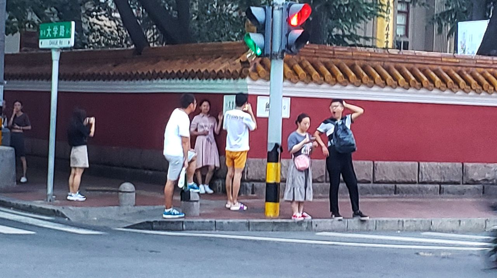

> 今天是个大日子，其一在于赶上新中国成立后第三十五个教师节，其二在于山人今日进了次城。前者让我一口气发了二十来条祝福短信，后者让我晚饭吃的无比丰盛满足。

### 教师节短信

一大早，本崽子就开始忙着构思今年的教师节祝福短信。按照本崽子自己总结出的祝福短信公式，最终的文本结构应该是这样的：

<b> 描写教师的诗文+直白祝福语+老师姓氏+署名 </b>

虽然有了固定公式，但难点在于教师相关的诗歌韵文的选取。思前想呀么后，终于叫我憋出~~(抄来)~~一句：

<b> 学高为师，身正为范。 </b>

请容本崽子自喜一会儿。 

### 地铁所见

今天下午不学习。买点月饼回家吃顿饭。一直待在学校复习，很久没有出门走动。 
回学校的时候，路过网红打卡地，都已经酉鸡日入时分，没想到还有小情侣在这个红墙岔路口拍照。话说我在这里生活了这么几年，还从来没有和它和过一次照嘞？！ 

等地铁正碰上中小学生放学，愣神的功夫被包围在蓝白校服的海洋中。叽叽喳喳，好不热闹！登车落座，斜对面映入眼帘的是二大束花，一上一下，啊不对，是一位携带两盆花的女人。今天是新中国第三十五个教师节，估计是一位受学生爱戴的人民教师吧。 
坐在我正对面的男孩子（小学生）临下车时突然行动，只见他虚晃一枪从学生堆里冲出，使出一招猴子上树，便攀上地铁竖立的金属扶杆。相较之下，坐在小猴旁边的女同学就文静许多，正是“丹唇外朗，皓齿内鲜，明眸善睐，[靥(yè)](https://baike.baidu.com/item/%E9%9D%A5)辅承权”[^1]。女生不急不徐款款从包中掏出作业，便写就起来。我的天，她在干什么？在地铁上写作业吗？每一届的学生压力都差不多啊，这事儿我也干过。 
我像她这么大时在山坡上[^2]念初中，上下学全凭借家里那辆电动车，遑论带空调的地铁，遇到风天，飞沙走石，真正体验到一骑绝千尘。到了高中，作业指数级增多，难度阶跃级飞升。高中暑假去城里上补习班，中午放学后搭公交回家，一来一回就得浪费掉将近一半的时间，没法子啊，只得在公交上晃晃悠悠地补作业，于是在报站上下车的音效中完成氧化还原反应方程式的配平。现在想想，在车上写作业，你会得到车上家长欣赏羡慕的目光、其他学生嗤之以鼻的不耐、以及东倒西歪的字体和不高的正确率......唉，那我刚刚是什么心情？！ 

[^1]: 这句话摘自[《洛神赋》](https://so.gushiwen.org/shiwenv_0559b0b0f385.aspx)。
[^2]: 还没盖初中前学校的位置是一处栽满桃树的小山坡。
