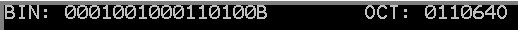

- - - 
### 引言

最近碰到这么一道类型转换题，要求很简单，将一个字长数据**1234H**转换成对应的二进制和八进制数，并将其打印到屏幕上。之前本小子也有遇到过类型转化的问题，如今只是多了显示的步骤，其实加上差值转换成数字对应的**ASCII**码即可。但我在[这位老哥](http://forec.cn)处发现一种新的思路，记之如下。

### 思路简介

汇编21H中断输出需要用到`DL`这个8-BIT寄存器存储待显示的内容(**BYTE**)，但题设中字(**WORD**)长数据所在位置为16-BIT存储器，所以考虑先将之移入`BX`寄存器，每次只保留高八位也就是`BH`的首位，再利用无符号数移位指令将其放到`BH`的末位从而获得该十六进制数的二进制形式首位。

该字长数据中包含4-BIT十六进制数据，为了转换为6-BIT的八进制数，需要单独仿照上述步骤分离出首位，`BX`中剩下的15-BIT二进制数每次只保留前三位在`BH`中，移到后三位即可获得该十六进制数八进制形式的第二位。

由于`ASCII[0]=30H`，所以将结果加上**30H**即可转化为对应的字符，送入`DL`后便可以通过**21H**中断在屏幕上显示啦。当然这只完成了一个数据的转化输出，想要得到整个十六位二进制数(或者六位八进制数)就需要每次将`BX`数据向左边移动一位(或三位)，从而保证`BH`中遍历所有数据。这种做法的关键点在于，移位指令需要`CL`作为计数器，而`BX`的循环左移需要`CX`做计数器，为了避免数据交叠，需要在`CL`设置移动步数前将`CX`内容入栈，在输出`BH`内容后将`CX`内容出栈，最后才可以左移`BX`中的数据。

### 流程图

#### 字长十六进制数据转换为二进制并输出

```flow
start=>start: 开始
op1=>operation: 将1234H存入BX中
op2=>operation: MOV AH,02H
				MOV CX,10H
op3=>operation: MOV DL,BH
				只保留BH的最高位 
				AND DL,80H
op4=>operation: PUSH CX
				MOV CL,07H
				SHR DL,CL
				将BH最高位移动到末位，其他位0
op5=>operation: ADD DL,30H
				将数字转化为对应字符
				POP CX
io1=>inputoutput: INT 21H
				开中断输出DL
op6=>operation: 将BX的下一位移到首位
				SHL BX,1
				CX--
cond1=>condition: CX=0?
e=>end: 结束

start->op1->op2->op3->op4->op5(right)->io1->op6(right)->cond1
cond1(no,right)->op3
cond1(yes)->e

```

#### 字长十六进制数据转换为八进制并输出

```flow
start=>start: 开始
op1=>operation: 将1234H存入BX中
op2=>operation: MOV AH,02H
				MOV CL,07H
				MOV DL,BH
				SHR DL,CL
				将BH最高位移到末位其他位0
op3=>operation: ADD DL,30H
				将数字转化为对应字符
io1=>inputoutput: INT 21H
				开中断输出DL
op4=>operation: SHL BX,1
				MOV CX,05H
				MOV AH,02H
op5=>operation: MOV DL,BH
				AND DL,E0H
				(保留BH前三位)
				PUSH CX
				MOV CL,05H
				SHR DL,CL
				(将高三位移到末三位)
				ADD DL,30H
				(将数字转化为对应字符)
				POP CX
io2=>inputoutput: INT 21H
				开中断输出DL
op6=>operation: SHL BX,3
				(将BX的另外三位移动到高三位)
				CX--
cond=>condition: CX=0?
e=>end: 结束

start->op1->op2->op3(right)->io1->op4->op5->io2
io2->op6(right)->cond
cond(yes)->e
cond(no,right)->op5
```

### 例子

#### 题设条件

TRY TO WRITE A PROGRAM WITH A NESTED STRUCTURE OF SUBROUTINES AND DISPLAY THE INTEGERS IN BINARY AND OCTAL FORMS.

+ MAIN PROGRAM BANDO:
 - STORE THE INTEGER NUMBERIC VARIABLE VAL1 IN THE STACK AND CALL THE SUBROUTINE PAIRS.
+ SUBROUTINE PAIRS:
 - REMOVE VAL1 FROM THE STACK.
 - CALL THE BINARY DISPLAY PROGRAM OUTBIN TO DISPLAY ITS EQUIVALENT BINARY NUMBER.
 - OUTPUT 8 SPACES.
 - CALL THE OCTAL DISPLAY PROGRAM OUTOCT TO DISPLAY ITS EQUIVALENT OCTAL NUMBER.
 - CALL THE SUBROUTINE BREAKLINE TO OUTPUT CARRIAGE RETURN AND LINE FEED.

#### 代码

<details>
<summary>点击查看代码</summary>

```
DATA SEGMENT
VAL1 DW 1234H
BINDISP DB 'BIN: $'
OCTDISP DB 'OCT: $'
SPACE DB '        $'				; DISPLAY 8 SPACES
BREAKLINE DB 0DH,0AH,'$'
DATA ENDS

STACK SEGMENT PARA STACK 'STACK'
DB 100 DUP(0)
STACK ENDS

CODE SEGMENT
ASSUME DS:DATA,CS:CODE
START:
	MOV AX,DATA
	MOV DS,AX
	MOV ES,AX
	CALL BANDO
QUIT:
	MOV AH,4CH
	INT 21H
									; MIAN PROGRAM BANDO
BANDO PROC NEAR
	PUSH VAL1
	CALL PAIRS
	RET
BANDO ENDP
									; SUBROUTINE PAIRS
PAIRS PROC NEAR
	POP BX
	POP AX
	CALL OUTBIN
	CALL OUTOCT
	RET
PAIRS ENDP
									; SUBROUTINE OUTBIN
OUTBIN PROC NEAR
	PUSH AX
	PUSH BX
	PUSH CX
	PUSH DX
	
	MOV BX,AX
	MOV AH,09H						; DISPLAY BINDISP
	MOV DX,OFFSET BINDISP
	INT 21H
	MOV CX,10H						; A WORD-FIUGRE HAS 16 BITS
	MOV AH,02H
	LOOP1:
		MOV DL,BH
		AND DL,80H					; KEEP THE FISRST BIT OF BH MERELY
		PUSH CX						; 'CAUSE SHR NEEDS USING CL, PUSH CX IN STACK TO BACKUP THE ORIGIN DATA
		MOV CL,07H
		SHR DL,CL					; SHIFT THE FIRST BIT OF BH TO THE LAST BIT, AND SET THE OTHER BITS OF BH 0
		POP CX
		ADD DL,30H					; CONVERT THE NUMBERIC FIGURE TO CHARACTER
		INT 21H						; OUTPUT DL
		SHL BX,1					; SHIFT THE WHOLE BX TO LEFT BY 1 BIT SO AS TO OUTPUT EACH BIT OF BX 
		LOOP LOOP1
	MOV AH,02H
	MOV DL,'B'						; OUTPUT 'B' FOLLOWING BX
	INT 21H
	MOV AH,09H
	MOV DX,OFFSET SPACE				; OUTPUT 8 SPACES FOLLOWING 'B'
	INT 21H
	POP DX
	POP CX
	POP BX
	POP AX
	RET
OUTBIN ENDP

OUTOCT PROC NEAR
	PUSH AX
	PUSH BX
	PUSH CX
	PUSH DX
	
	MOV BX,AX
	MOV AH,09H						; DISPLAY OCTDISP
	MOV DX,OFFSET OCTDISP
	INT 21H
	MOV CL,07H						; OUTPUT THE FIRST BIT OF BX
	MOV AH,02H
	MOV DL,BH
	AND DL,80H
	SHR DL,CL
	ADD DL,30H
	INT 21H
	SHL BX,1						; SHIFT THE WHOLE BX TO LEFT BY 1 BIT
	MOV CX,05H						; A OCTAL FIGURE EQUALS TO 3 BINARY BITS, THERE ARE 5 OCTAL FIGURES EXCEPT THE FIRST BIT
	LOOP2:
		MOV DL,BH
		AND DL,0E0H					; KEEP THE FIRST 3 BITS OF BH MERELY
		PUSH CX
		MOV CL,05H					; SHIFT THE FIRST 3 BITS OF BH TO THE LAST 3 BITS, AND SET THE OTHER BITS OF BH 0
		SHR DL,CL
		POP CX
		ADD DL,30H
		INT 21H
		SHL BX,3					; SHIFT THE WHOLE BX TO LEFT BY 3 BITS SO AS TO CONVERT EACH 3 BITS OF BX TO A OCTAL
		LOOP LOOP2					; FIGURES AND OUTPUT THEM
	MOV AH,02H
	MOV DL,'O'						; OUTPUT 'B' FOLLOWING BX
	INT 21H
	CALL NEXTLINE					; CALL THE SUBROUTINE BREAKLINE
	POP DX
	POP CX
	POP BX
	POP AX
	RET
OUTOCT ENDP

NEXTLINE PROC NEAR
	PUSH AX
	PUSH DX
	MOV AH,09H
	MOV DX,OFFSET BREAKLINE
	INT 21H
	POP DX
	POP AX
	RET
NEXTLINE ENDP

CODE ENDS
	END START
```
</details>

#### 运行结果


