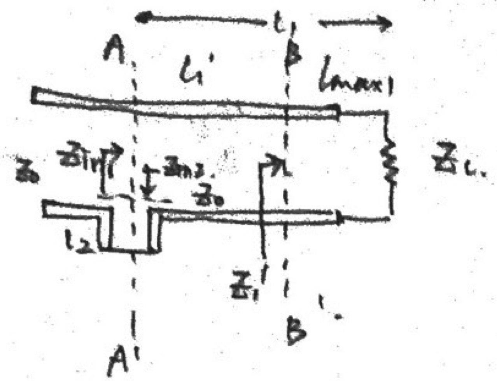
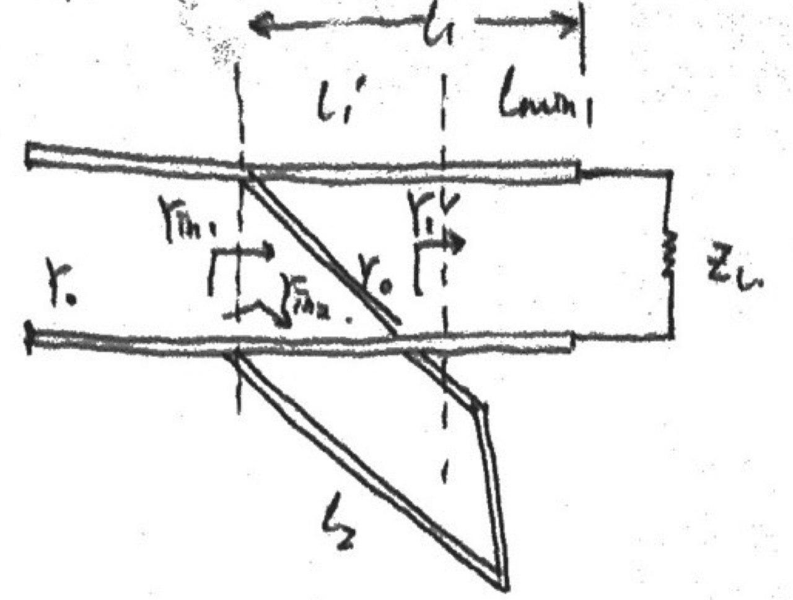

> 前面提到了借助[SmithChart进行阻抗匹配](https://callmemengmeng.github.io/2020/02/29/SmithChart%E8%BF%9B%E8%A1%8C%E9%98%BB%E6%8A%97%E5%8C%B9%E9%85%8D%E7%9A%84%E4%B8%A4%E4%B8%AA%E5%AE%9E%E4%BE%8B/)的方法，当然阻抗匹配问题也可以使用更为直接的公式计算，其公式推导并不复杂，但其数值计算量较大，对我而言得找算力工具打下手。

## 阻抗匹配基础回顾

“THE MORE CHICKENS AND DUCKS, THE MORE POOPS AND DRAMAS.”—— REYES MENG

### 传输线有三种匹配状态

阻抗匹配需要信号源、传输线和负载的相互配合，当这三位能搭伙一起融洽生活，阻抗就匹配了，反射波就消失了，负载功率才能最大化。阻抗匹配包括负载阻抗匹配、源阻抗匹配和共轭阻抗匹配三种分别对应传输线的三种工作状态。

#### 负载阻抗匹配

负载阻抗匹配是令负载阻抗等于传输线的特性阻抗，即$Z_l=Z_0$，此时传输线上只有从信源到负载的入射波而无反射波。负载阻抗匹配一般采用阻抗匹配。

#### 源阻抗匹配

电源内阻等于传输线的特性阻抗时，即$Z_g=Z_0$，电源和传输线达到匹配。此时负载的反射波被电源吸收，常用方法是加去耦衰减器或隔离器来吸收反射波。

#### 共轭阻抗匹配

分析共轭阻抗匹配需要结合负载功率的最大取值。对于简单的“电源-传输线-负载”系统，设信源电动势为$E_g$，源内阻抗为$Z_g=R_g+\jmath X_g$，传输线的特性阻抗为$Z_0$，传输线总长度为$l$，负载为$Z_l$，那么从始端($z=l$处)看进去的输入阻抗为：
$$Z_{in}=Z_0\frac{Z_l+\jmath Z_0\tan(\beta l)}{Z_0+\jmath Z_l\tan(\beta l)}=R_{in}+\jmath X_{in}$$
可以得到$R_{in}$和$X_{in}$的表达式。令$Z_{in}=Z_g^{\ast}=R_g-\jmath X_g$，负载功率为：
$$P=\frac{1}{2}\frac{E_gE_g^{\ast}}{(Z_g+Z_{in})(Z_g+Z_{in})^{\ast}}R_{in}$$整理得：$$P=\frac{1}{2}\frac{|E_g|^2}{[(R_g+R_{in})+\jmath(X_g+X_{in})][(R_g+R_{in})-\jmath(X_g+X_{in})]}R_{in}$$进一步化简：$$P=\frac{1}{2}\frac{|E_g|^2}{(R_g+R_{in})^2+(X_g+X_{in})^2}R_{in}$$欲使得负载功率最大化，则必须$X_{in}=-X_g$，且当$\frac{dP}{dR_{in}}$时取得最大，此时满足$R_g=R_{in}$。

亦即当$Z_{in}=Z_g^{\ast}$时满足共轭匹配，负载功率取得最大值为：$$P_{max}=\frac{1}{2}\frac{|E_g|^2}{(R_g+R_{in})^2}R_{in}=\frac{1}{2}|E_g|^2\frac{1}{4R_g}$$

## 阻抗匹配方法

### 四分之一波长阻抗变换器法

传输线的$\frac{\lambda}{4}$阻抗变换性告诉我们：**无耗传输线上距离为四分之一波长的任意两点处阻抗的乘积均等于传输线特性阻抗的平方**。利用这个性质，可以在纯电阻负载和传输线间加一段长度为$\frac{\lambda}{4}$、特性阻抗为$Z_{01}$的传输线。根据传输线输入阻抗公式可知变换器输入阻抗为：$$Z_{in}=Z_{01}\frac{Z_l+\jmath Z_{01}\tan(\beta\frac{\lambda}{4})}{Z_{01}+\jmath Z_l\tan(\beta\frac{\lambda}{4})}=\frac{Z_{01}^2}{R_l}$$因此传输线的特性阻抗$Z_{01}=\sqrt{Z_0R_l}$，即$Z_{in}=Z_0$时，可以实现阻抗匹配。但是阻抗变换器的长度取决于波长，它只能在中心频率点达到匹配，频偏存在时频率变差，因此这种方法是窄带的。

### 单支节调配器法

-*- 下面仅仅讨论终端短路的单支节调配器法 -*-

#### 串联单支节调配器

各项参数如下所示：

| 描述 | 参数 |
|:----:|:----:|
| 传输线和调配支节特性阻抗 | $Z_0$ |
| 负载阻抗 | $Z_l$ |
| 调配支节长度 | $l_2$ |
| 调配支节到负载距离 | $l_1$ |
| 调配支节处输入阻抗 | $Z_{in2}$ |
| $AA^{'}$处输入阻抗 | $Z_{in1}$ |
| $BB^{'}$处输入阻抗 | $Z_l^{'}$ |
| 传输线的工作波长 | $\lambda$ |
| 驻波比 | $\rho$ |
| 离负载第一个电压波腹点位置 | $l_{max1}$ |

在第一个波腹点处，有：
$$\begin{cases}
l_{max1}=\frac{\lambda}{4\pi}\phi_l\\\\
Z_l^{'}=Z_0\rho
\end{cases}$$

在$AA^{'}$处，有：
$$\begin{cases}
l_1^{'}=l_1-l_{max1}\\\\
Z_{in1}=Z_0\frac{Z_l^{'}+\jmath Z_0\tan(\beta l_1^{'})}{Z_0+\jmath Z_l^{'}\tan(\beta l_1^{'})}
\end{cases}$$短路支节的负载为0，故调配支节处输入阻抗满足$Z_{in2}=Z_0\frac{0+\jmath Z_0\tan(\beta l_2)}{Z_0+0}=\jmath Z_0\tan(\beta l_2)$，所以输入阻抗$Z_{in}=Z_{in1}+Z_{in2}$可以写成：
$$Z_{in}=Z_0\frac{Z_l^{'}+\jmath Z_0\tan(\beta l_1^{'})}{Z_0+\jmath Z_l^{'}\tan(\beta l_1^{'})}+\jmath Z_0\tan(\beta l_2)$$
通分化简得：
$$Z_{in}=\frac{Z_0^2Z_l^{'}[1+{\tan^2(\beta l_1^{'})}]}{Z_0^2+Z_l^{'2}\tan^2(\beta l_1^{'})}+\jmath[\frac{Z_0(Z_0^2-Z_l^{'2})\tan(\beta l_1^{'})}{Z_0^2+Z_l^{'2}\tan^2(\beta l_1^{'})}+Z_0\tan(\beta l_2)]$$
令$Re[Z_{in}]=Z_0$，解得$\tan^2(\beta l_1^{'})=\frac{Z_0}{Z_l^{'}}=\frac{1}{\rho}$；令$Im[Z_{in}]=0$，解得$\tan(\beta l_2)=\pm\frac{\rho-1}{\sqrt{\rho}}$，鉴于$\beta=\frac{2\pi}{\lambda}$，可整理出两组解：

$\begin{cases}
l_1^{'}=\frac{\lambda}{2\pi}\arctan(\frac{1}{\sqrt{\rho}})\\\\
l_2=\frac{\lambda}{2\pi}\arctan(\frac{\rho-1}{\sqrt{\rho}})
\end{cases}$或$\begin{cases}
l_1^{'}=-\frac{\lambda}{2\pi}\arctan(\frac{1}{\sqrt{\rho}})\\\\
l_2=\frac{\lambda}{4}+\frac{\lambda}{2\pi}\arctan(\frac{\sqrt{\rho}}{\rho-1})
\end{cases}$

调配支节到负载距离$l_1=l_1^{'}+l_{max1}$。

#### 并联单支节调配器

并联单支节调配器的阻抗匹配分析方法和串联单支节类似，不过此处我们用导纳来代替阻抗方便分析。各项参数如下所示：

| 描述 | 参数 |
|:----:|:----:|
| 传输线和调配支节特性导纳 | $Y_0$ |
| 负载导纳 | $Y_l$ |
| 调配支节长度 | $l_2$ |
| 调配支节到负载距离 | $l_1$ |
| 调配支节处输入导纳 | $Y_{in2}$ |
| $AA^{'}$处输入导纳 | $Y_{in1}$ |
| $BB^{'}$处输入导纳 | $Y_l^{'}$ |
| 传输线的工作波长 | $\lambda$ |
| 驻波比 | $\rho$ |
| 离负载第一个电压波节点位置 | $l_{min1}$ |

在第一个波节点处，有：
$$\begin{cases}
l_{min1}=\frac{\lambda}{4\pi}\phi_l\pm\frac{\lambda}{4}\\\\
Y_l^{'}=Y_0\rho
\end{cases}$$
输入导纳分别为：
$$Y_{in1}=Y_0\frac{Y_l^{'}+\jmath Y_0\tan(\beta l_1^{'})}{Y_0+\jmath Y_l^{'}\tan(\beta l_1^{'})}$$ $$Y_{in2}=\frac{1}{\jmath Z_0\tan(\beta l_2)}=-\frac{\jmath Y_0}{\tan(\beta l_2)}$$
所以输入导纳$Y_{in}=Y_{in1}+Y_{in2}$可以写成：
$$Y_{in}=Y_0\frac{Y_l^{'}+\jmath Y_0\tan(\beta l_1^{'})}{Y_0+\jmath Y_l^{'}\tan(\beta l_1^{'})}-\frac{\jmath Y_0}{\tan(\beta l_2)}$$
通分化简得：
$$Y_{in}=\frac{Y_0^2Y_l^{'}[1+{\tan^2(\beta l_1^{'})}]}{Y_0^2+Y_l^{'2}\tan^2(\beta l_1^{'})}+\jmath[\frac{Y_0(Y_0^2-Y_l^{'2})\tan(\beta l_1^{'})}{Y_0^2+Y_l^{'2}\tan^2(\beta l_1^{'})}-\frac{Y_0}{\tan(\beta l_2)}]$$
令$Re[Y_{in}]=Y_0$，解得$\tan^2(\beta l_1^{'})=\frac{Y_0}{Y_l^{'}}=\frac{1}{\rho}$；令$Im[Y_{in}]=0$，解得$\tan(\beta l_2)=\pm\frac{\sqrt{\rho}}{1-\rho}$，鉴于$\beta=\frac{2\pi}{\lambda}$，可整理出两组解：

$\begin{cases}
l_1^{'}=\frac{\lambda}{2\pi}\arctan(\frac{1}{\sqrt{\rho}})\\\\
l_2=\frac{\lambda}{4}-\frac{\lambda}{2\pi}\arctan(\frac{1-\rho}{\sqrt{\rho}})
\end{cases}$或$\begin{cases}
l_1^{'}=-\frac{\lambda}{2\pi}\arctan(\frac{1}{\sqrt{\rho}})\\\\
l_2=\frac{\lambda}{4}+\frac{\lambda}{2\pi}\arctan(\frac{1-\rho}{\sqrt{\rho}})
\end{cases}$

调配支节到负载距离$l_1=l_1^{'}+l_{min1}$。

## 公式计算法串联单支节阻抗匹配实例

### 题目条件

一均匀无耗传输线的特性阻抗为$70\Omega$，负载阻抗为$Z_l=70+\jmath140\Omega$，工作波长$\lambda=20cm$。使用公式法设计串联短路支节匹配器的位置和长度。

### 计算分析

#### 求终端反射系数

$$\Gamma_l=|\Gamma_l|e^{\jmath\phi_l}=\frac{Z_l-Z_0}{Z_l+Z_0}$$代入数据得：$$\Gamma_l=\frac{\jmath140}{140+\jmath140}=\frac{\sqrt{2}}{2}e^{\jmath\frac{\pi}{4}}$$

#### 求驻波比和波长

条件已知波长$\lambda=20cm$，由终端反射系数可计算出驻波比为：$$\rho=\frac{1+|\Gamma_l|}{1-|\Gamma_l|}=5.828$$

#### 求第一个波腹点的位置

$$l_{max1}=\frac{\lambda}{4\pi}\phi_l=\frac{\lambda}{4\pi}\frac{\pi}{4}=1.25cm$$

#### 求调配支节的位置与长度

$$\begin{cases}
l_1=l_{max1}+\frac{\lambda}{2\pi}\arctan(\frac{1}{\sqrt{\rho}})=2.5cm\\\\
l_2=\frac{\lambda}{2\pi}\arctan(\frac{\rho-1}{\sqrt{\rho}})=3.5cm
\end{cases}$$

#### 另一组解

$$\begin{cases}
l_1=l_{max1}-\frac{\lambda}{2\pi}\arctan(\frac{1}{\sqrt{\rho}})=0\\\\
l_2=\frac{\lambda}{4}+\frac{\lambda}{2\pi}\arctan(\frac{\sqrt{\rho}}{\rho-1})=6.5cm
\end{cases}$$
显然，计算出的解和前面使用圆图法读出的解误差不大。

## 公式计算法并联单支节阻抗匹配实例

### 题目条件

特性阻抗为$50\Omega$的无耗传输线，终端接阻抗为$Z_l=25+\jmath75\Omega$的负载，采用短路单支节匹配，使用公式计算法求并联支节的位置和长度。

### 计算分析

#### 求终端反射系数

$$\Gamma_l=|\Gamma_l|e^{\jmath\phi_l}=\frac{Z_l-Z_0}{Z_l+Z_0}$$代入数据得：$$\Gamma_l=\frac{-25+\jmath75}{75+\jmath75}=\frac{\sqrt{5}}{3}\angle1.107$$

#### 求驻波比和波长

将波长记为$\lambda$，由终端反射系数可计算出驻波比为：$$\rho=\frac{1+|\Gamma_l|}{1-|\Gamma_l|}=6.854$$

#### 求第一个波节点的位置

$$l_{min1}=\frac{\lambda}{4\pi}\phi_l+\frac{\lambda}{4}$$

#### 求调配支节的位置与长度

$$\begin{cases}
l_1=l_{min1}+\frac{\lambda}{2\pi}\arctan(\frac{1}{\sqrt{\rho}})=0.396\lambda\\\\
l_2=\frac{\lambda}{4}-\frac{\lambda}{2\pi}\arctan(\frac{1-\rho}{\sqrt{\rho}})=0.433\lambda
\end{cases}$$

#### 另一组解

$$\begin{cases}
l_1=l_{min1}-\frac{\lambda}{2\pi}\arctan(\frac{1}{\sqrt{\rho}})=0.28\lambda\\\\
l_2=\frac{\lambda}{4}+\frac{\lambda}{2\pi}\arctan(\frac{1-\rho}{\sqrt{\rho}})=0.0669\lambda
\end{cases}$$
显然，计算出的解和前面使用圆图法读出的解误差不大。