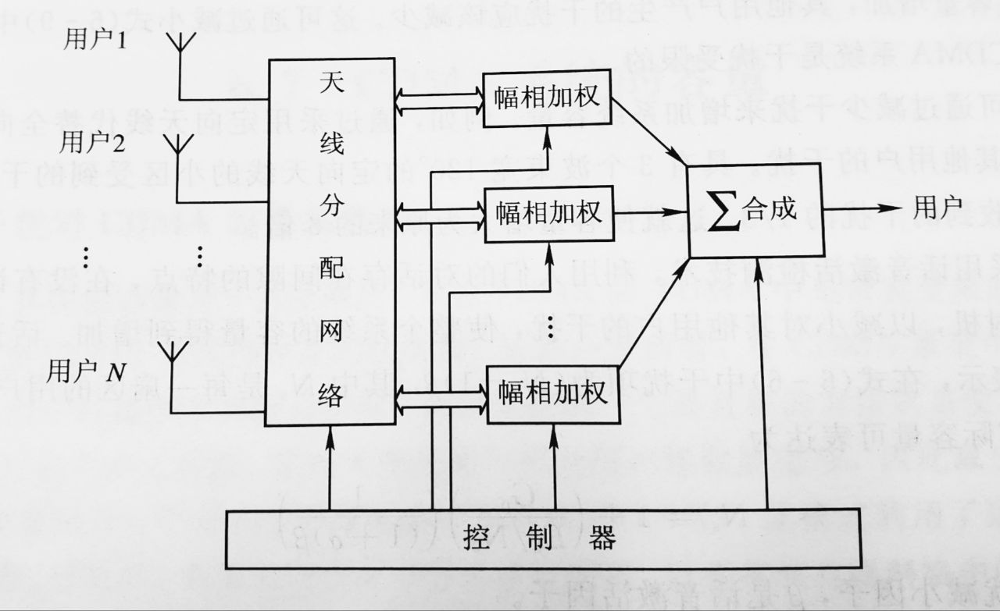

> 这学期有一门叫做《文献综述》的课程，课上主要教授一些科研论文的行文规范、论文检索与阅读等相关内容。课程形式不重要，有意思的是老师课上布置的一个综述撰写课题——**波束形成**。波束形成是**智能天线**的关键，而这俩货均是**5G通信**中的明星技术。所以咱就把过程中搜集到涉及**智能天线技术**的资料堆砌如下以便翻阅。

## 引言

智能天线(Smart Antenna)系统是由天线阵列、幅相加权、合成器和控制器组成的。每个阵元所接收到的信号先进行幅相加权，其权值是由控制器通过不同的自适应算法来调整的。被加权的信号进行合成，产生阵列输出，也就是形成若干个自适应波束，同时自动跟踪若干个用户。智能天线所形成的波束能实现空间滤波，它使得期望信号的方向具有高增益，而干扰方向近似零陷，以达到抑制和减少干扰的目的。天线阵元的数目$N$与天线配置的方式对智能天线的性能有着直接的影响。
 

在**CDMA**通信系统中，我们能按照CDMA编码形式形成响应的天线波束，使不同的用户编码形成不同用户的窄带波束，从而大大提高CDMA通信系统的容量。这是CDMA通信使用智能天线技术的最大优点。
 

目前，已经提出将智能天线用于移动通信系统以提高系统容量，满足日益增多的移动用户的需求。此外，智能天线还能通过提高频谱利用率，扩大覆盖范围，使用多波束跟踪移动用户，补偿孔径失真，降低延迟扩展[^1]、[多径衰落](https://baike.baidu.com/item/%E5%A4%9A%E5%BE%84%E8%A1%B0%E8%90%BD)、共道干扰、系统复杂性、误码率和中断概率[^2]等来改善系统的性能。
 

智能天线能根据信号环境的变化，根据采用的优化准则([MMSE](https://blog.csdn.net/zhihuiyu123/article/details/83245946)、[SNR](https://blog.csdn.net/ueh286/article/details/101202617)、LH)自适应地调整加权矢量，相应地天线的方向图，以跟踪信号的变化。不过，由于各种准则的最优权值均收敛于最优维纳解，因此准则的选择并不重要，主要是智能算法的选择，因为算法决定了天线阵列暂态响应的速率和实现电路的复杂度，这是智能天线系统的核心部分。

## 智能天线经典算法

经典的自适应算法按照有无反馈环路，可以分为闭环算法和开环算法两大类。对比而言，闭环算法比较简单，且实现的代价小，但是由于它的收敛速度比较慢，因此限制了它在许多场合的应用；而开环算法虽然收敛速度快，但是受到求解的数值精度和阵列协方差矩阵求逆运算量的限制，且算法比较复杂。开环自适应算法主要有[LMS](#LMS)、[SMI](#SMI)、[RLS](#RLS)等。

### 最小均方(LMS)算法

<b>LMS</b>算法是将最陡下降法应用于MSE(均方差)性能度量的一种估计，可采用数字闭环法来实现。其阵列加权矢量更新的递推公式为$$W(n+1)=W(n)+\mu(e^\ast(n))X(n)$$其中$e^\ast(n)$表示$e(n)$的共轭，$e(n)=y(n)-d(n)=W^H(n)X(n)-d(n)$为天线的暂态误差，$y(n)$为天线阵列输出，$W^H$表示矩阵$W$的共轭转置，$d(n)$为与期望信号有很大相关性的参考信号；$\mu$为步长，是控制收敛速度和稳定性的标量常数因子，当选择$0<\mu<\frac{2}{Tr(R)}$时算法收敛，其中$Tr(R)$为数据自相关矩阵$R$的迹，$R=E[X(n)X^T(n)]$；$X(n)$是在第$n$个时刻对阵列信号的取样，包含期望信号、干扰和白噪声。
 

根据维纳解，基于LMS算法的最优权矢量可以表示为$$W_{opt}=R^{-1}r_{xd}$$式中：$r_{xd}$为参考信号$d(n)$和阵列取样数据$X(n)$的互相关矢量。
 

LMS算法结构简单，但是其收敛速度很慢，且算法的性能对$R$的特征值散布度很敏感。当特征值散布度很大时，算法收敛速度相当慢，有时甚至很难收敛，这也就限制了它在一些信号变化快的场合的应用。

### 取样矩阵求逆(SMI)算法

<b>SMI</b>算法是一种开环计算方法。它通过直接求解阵列协方差矩阵$R$来估计权矢量，能够实现与特征值散布度无关的最快的收敛速度。
 

假设天线为$N$阵元的线阵结构，接收信号$X(n)$(为$1\times{N}$的复向量)可表示为$$X(n)=\displaystyle\sum^{M}_{i=1}S_i(n)a_i(\theta_i)+N(n)$$式中：$S_i(n)$表示第$i$个辐射源的发送信号；$a_i(\theta_i)$是第$i$个辐射源的空间响应函数，$a_i(\theta_i)=e^{j2\pi\frac{d}{\lambda}(i-1)\sin(\theta_i)}$。
 

在实际应用中，可以如下求解：假设$X(n)$的$K$次取样组成一个$N\times K$的矩阵，表示为$$X_K(n)=\begin{bmatrix}
{x_1(n)}&{\cdots}&{x_N(n+K-1)}\\\\
{x_2(n)}&{\cdots}&{x_N(n+K-1)}\\\\
{\vdots}&{\ddots}&{\vdots}\\\\
{x_N(n)}&{\cdots}&{x_N(n+K-1)}\\\\
\end{bmatrix}$$则$R(n)=X_K(n)\times{X^T_K(n)}$，$N\times{1}$的互相关矢量为$$Q(n)=X(n)\times{d(n)}$$式中：$d(n)=[d(n)d(n+1){\cdots}d(n+K-1)]^T$是一个$K\times{1}$的列矢量。SMI算法得到的最优解为$$W(n)=R(n)^{-1}\times{Q(n)}=[X^T_K(n)\times{X_K(n)}]^{-1}[X^T_K(n)\times{d(n)}]$$

分析表明，当取样数$K\geq{2N}$时，它就能收敛到最优值的$3dB$之内。但是当干扰分布广泛时，收敛所需的取样数大。由于该算法的计算复杂性与$N^3$成正比，因此对于小型阵的计算效率很高，而对于大型阵列，它所要求的信号处理能力很强。此外，对于给定的$K$值，由时间平均得到的估计的质量依赖于输入$SNR$，当输入$SNR$下降时，估计质量下降，则需要更多的取样值消除噪音的干扰，才能得到更精确的估计。

### 递归最小二乘(RLS)算法

<b>RLS</b>算法是基于使每一快拍的阵列输出误差平方和最小的准则，即最小二乘(LS)准则，采用数据域递推方法来完成矩阵的求逆运算。它利用了从算法初始化后得到的所有阵列数据信息，其加权矢量更新的递推公式为$${W(k+1)=W(k)-\frac{P(k)e^\ast_k(k+1X(k+1))}{\mu+X^T(k+1)P(k)X(k+1)}}$$ $${e_k(k+1)=W^T(k)X(k+1)-d(k+1)}$$ $$P(k+1)=\frac{1}{\mu}\lbrace P(k)-\frac{P(k)X(k+1)X^T(k+1)P(x)}{\mu+X^T(k+1)P(x)X(k+1)} \rbrace$$式中：$\mu(0<\mu<1)$称为遗忘因子，其作用是削弱旧的数据取样值对后面计算的影响。$\mu$越大，表示旧的数据对后面计算结果的影响越大。
 

RLS算法的收敛速度比较快，其收敛速度对特征值的散布度不敏感。与SMI算法相比，虽然RLS算法的收敛速度不如SMI快，但其计算复杂度明显减小，因此在实际应用中使用较多。
 

[^1]: 由于到达接收机的信号经过不同路径，有时间差异，所以延迟扩展指最大传输时延和最小传输时延的差值，即最后一个可分辨的时延信号与第一个时延信号到达时间的差值，实际上就是脉冲展宽的时间。
[^2]: 中断概率是链路容量的另一种表达方式，当链路容量不能满足所要求的用户速率时，就会产生中断事件，这个事件呈概率分布的，取决于链路的平均信噪比及其信道衰落分布模型。