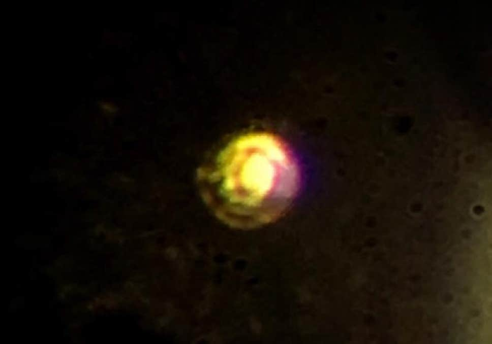

> 氢 **(H)** 锂 **(Li)** 钠 **(Na)** 钾 **(K)** 铷 **(Rb)** 铯 **(Cs)** 钫 **(Fr)**，这是元素周期表的第一族，同样是一家人，大家最外层都只有一个电子，凭嘛就你氢 **(H)** 特殊不是金属咧？

根据门捷列夫先生排列出的元素周期表可知，最左侧的第一列元素有**氢(H)**、**锂(Li)**、**钠(Na)**、**钾(K)**、**铷(Rb)**、**铯(Cs)**、**钫(Fr)**。然而这一列中，只有氢是气体，不是金属。除了氢，其他属于这一列的元素被统称为**“碱金属”**。 
高中化学告诉我们，这些碱金属元素的内层电子数量各不相同，但是最外层轨道都只有1个电子。它们很容易失去最外围的那个电子，形成+1价的阳离子，其他化学性质也非常相似。它们都是金属，但能溶于水形成碱性溶液，因此得名。 
氢被排除在碱金属之外，是因为它一共只有1个电子，原子本身就很小，这对它的反应模式和性质产生了影响。不过，当我们向氢施加超高压时，它就会变成金属，称**“金属氢”**。 

 

金属氢呈现出的性质与碱金属非常相似。因此科学家们普遍认为，在气压巨大的木星与土星内部，也许真的存在金属氢。 

及金属氦") 

1935年物理学家[尤金·维格纳](https://baike.baidu.com/item/%E5%B0%A4%E9%87%91%C2%B7%E7%BB%B4%E6%A0%BC%E7%BA%B3/4007260)和[希拉德·亨廷顿](https://en.wikipedia.org/wiki/Hillard_Bell_Huntington)预测，所谓金属氢是一种氢元素的简并态物质，是双原子分子$H_2$的同素异形体，在氢气被充分压缩相变后产生。记得前年学术界还闹过一出乌龙，哈佛大学研究团队通过对氢气施加$495GPa$的高压宣布制得固态金属氢,然而同年二月由于操作失误，盛放金属氢的钻石容器破裂，这块[金属氢样本消失了](https://www.independent.co.uk/news/science/metallic-hydrogen-disappears-technology-revolutions-superconductor-faster-computers-super-efficient-a7593481.html)。