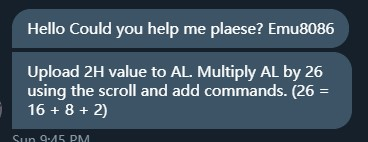
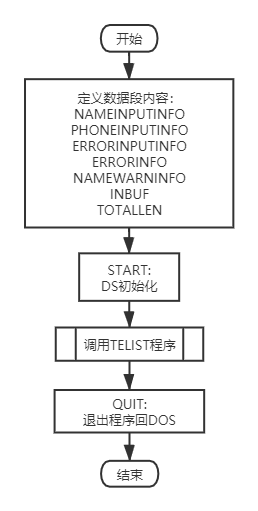
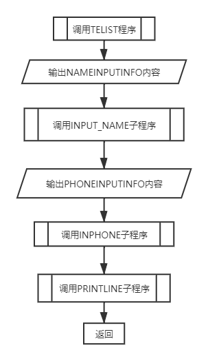
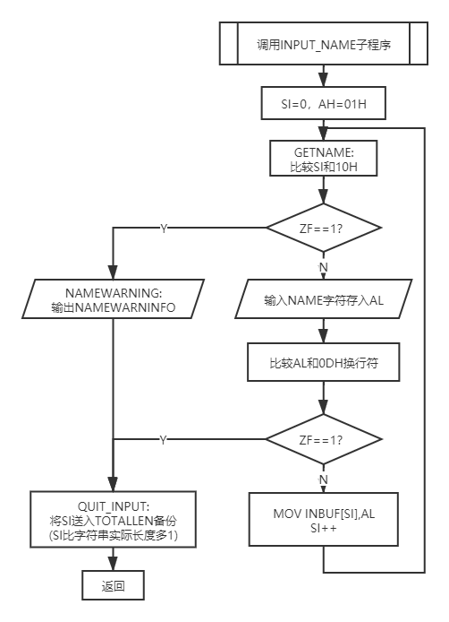
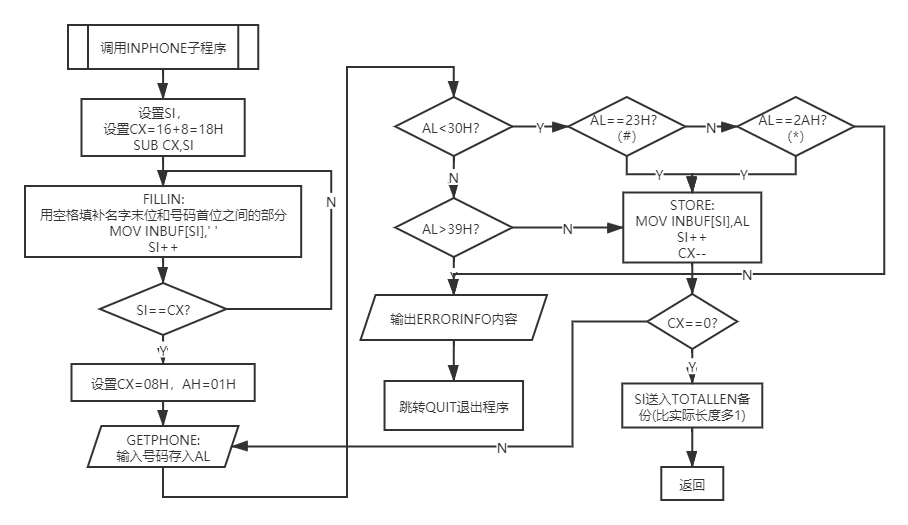
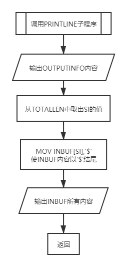

> 由于某些原因，本小子开始从头学习[《微机原理与接口技术》](http://www.tup.tsinghua.edu.cn/booksCenter/book_03735601.html)这门课，为了尽快熟悉汇编语言，遂连续两星期坚持每天动手写几个小程序练手，获益良多。最近两天遇到两道较有意思的题目，简单整理以记之。

## SHR+ADD实现简单乘法

首先需要明确的是，将一个二进制数左移一位相当于扩大两倍，右移一位相当于缩小为原来的二分之一。这点很好理解：
$$0001(B)=01(H)\stackrel{左移1位}\rightarrow0010(B)=02(H)$$ $$1000(B)=08(H)\stackrel{右移1位}\rightarrow0100(B)=04(H)$$
题目来源很有意思，有一位来自[Düzce University](https://en.duzce.edu.tr/)的同鞋私信给我这道题寻求帮助，本小子当时内心惶恐(~其实我是新手啊~)，细看之后发觉我在中科大的一份PPT上看到过类似题目。题目如下：

不多废话，直接上代码：
```
CODE	SEGMENT
	ASSUME	CS:CODE
	START:	MOV AL,02H
		MOV BL,AL
		MOV CL,AL
		SHL CL,1    ; 02H*2
		SHL BL,3    ; 02H*8
		ADD BL,CL   ; 02H*(2+8)
		SHL AL,4    ; 02H*16
		ADD BL,AL   ; 02H*(2+8+16)=02H*26
						
		MOV AH,4CH
		INT 21H
CODE	ENDS
		END START
```

## 利用中断进行输入输出

我遇到的题目大都是使用21H中断实现输入输出，其大致步骤分为：
+ 将系统功能号送`AH`中；
+ 将入口参数送达指定寄存器；
+ 使用`INT 21H`执行功能调用。

而汇编中常用到的21H系统功能号及其参数如下表[^1]：

| `AH` | 功能 | 入口参数 | 出口参数 |
|:----:|:----:|:--------:|:--------:|
| 1 | 键盘输入一个字符到`AL`中 | 无 | `AL`(字符) |
| 2 | 输出`DL`寄存器的字符到显示器 | `DL`(存放一个字符) | 无 |
| 9 | 输出一个以'$'结尾的字符串到显示器 | `DS`(字符串所在的段地址)、`DX`(字符串的首地址) | 无 |
| 0AH | 从键盘输入一个字符串到指定的缓冲区 | `DS`(缓冲区所在的段地址)、`DX`(缓冲区的首地址) | 缓冲区位置 |
| 4CH | 返回DOS | 无 | 无 |

更详细的`INT 21H`功能参数可以参考[此表](https://www.cnblogs.com/ynwlgh/archive/2011/12/12/2285017.html)。

### 题目描述

编写一个子程序嵌套的结构的程序模块，分别从键盘输入姓名以及8个字符的电话号码，并以一定的格式显示出来。
+ 主程序`TELIST`:
 - 显示提示符`INPUT NAME: `
 - 调用子程序`INPUT_NAME`输入姓名
 - 显示提示符`INPUT A TELEPHONE NUMBER: `
 - 调用子程序`INPHONE`输入电话号码
 - 调用子程序`PRINTLINE`显示姓名和号码
+ 子程序`INPUT_NAME`
 - 调用键盘输入子程序`GETNAME`把输入的姓名存入`INBUF`缓冲区
+ 子程序`INPHONE`
 - 调用键盘输入子程序`GETPHONE`把输入的电话号码放入`INBUF`缓冲区
+ 子程序`PRINTLINE`
 - 显示姓名以及电话号码，格式为：
 ```
 NAME                    TEL
 XXXXXX                  XXXXXXXX
 ```

### 流程图分析

要实现电话本效果，根据题目描述可以将整个程序划分为五块内容，为“START”、“TELIST”、“INPUT_NAME”、“INPHONE”和“PRINTLINE”，分别画其流程图。[^2]

#### START程序



#### TELIST程序



#### INPUT_NAME子程序



#### INPHONE子程序



#### PRINTLINE子程序



### 代码

<details>
<summary>点击查看代码</summary>

```
; ENVIRONMENT: EMU8086

DATA	SEGMENT
NAMEINPUTINFO	DB	'PLEASE INPUT NAME: $'
PHONEINPUTINFO	DB	'INPUT THE TELEPHONE NUMBER: $'
ERRORINFO		DB	0DH,0AH,'THE NUMBER YOU INPUT SHOULD BETWEEN 0-9 OR * OR # !$'
NAMEWARNINFO	DB	0DH,0AH,'LENGTH OF NAME CANNOT LONGER THAN 8 CHARACTERS!',0DH,0AH,'$'
OUTPUTINFO		DB	0DH,0AH,'NAME                    TEL',0DH,0AH,'$'
INBUF			DB	32 DUP(0)
TOTALLEN		DW	0
DATA	ENDS

STACK	SEGMENT	PARA	STACK	'STACK'
DB	100H	DUP(0)
STACK	ENDS

CODE	SEGMENT
ASSUME	DS:DATA,CS:CODE
START:	MOV AX,DATA
		MOV DS,AX
		MOV ES,AX
		CALL TELIST
		
QUIT:	MOV AH,4CH
		INT 21H
		
TELIST PROC NEAR
		MOV AH,09H
		MOV DX,OFFSET NAMEINPUTINFO
		INT 21H
		CALL INPUT_NAME
		
		MOV AH,09H
		MOV DX,OFFSET PHONEINPUTINFO
		INT 21H
		CALL INPHONE
		
		CALL PRINTLINE
		RET
TELIST	ENDP

INPUT_NAME PROC NEAR
		MOV SI,0
		MOV AH,01H
GETNAME: CMP SI,10H
		JZ	NAME_WARNING
		INT 21H
		CMP AL,0DH
		JZ	QUIT_INPUT
		MOV INBUF[SI],AL
		INC SI
		JMP GETNAME
NAME_WARNING: MOV AH,09H
		MOV DX,OFFSET NAMEWARNINFO
		INT 21H
QUIT_INPUT: MOV TOTALLEN,SI
		RET
INPUT_NAME ENDP

INPHONE PROC NEAR
		MOV SI,TOTALLEN
		MOV CX,18H				; THERE SHOULD BE 8 UNITS BETWEEN NAME STRING (16 CHARACTERS) AND 
		SUB CX,SI				; PHONE ARRAY (8 NUMBERS), BUT I WANNA FILLING ALL THE UNITS  WHICH 
FILLIN:	MOV INBUF[SI],' '				; START AFTER THE LAST CHARACTER AND END BEFORE THE FIRST NUMBER WITH 
		INC SI					; 'SPACE'.
		LOOP FILLIN
		
		MOV CX,08H
		MOV AH,01H
GETPHONE: INT 21H
		CMP AL,23H
		JZ	STORE
		CMP AL,2AH
		JZ	STORE
		CMP AL,30H
		JL	ERRORINPUT
		CMP AL,39H
		JG ERRORINPUT
STORE:	MOV INBUF[SI],AL
		INC SI
		LOOP GETPHONE
		MOV TOTALLEN,SI
		RET
ERRORINPUT: MOV AH,09H
		MOV DX,OFFSET ERRORINFO
		INT 21H
		JMP QUIT_INPUT
INPHONE	ENDP

PRINTLINE PROC NEAR
		MOV AH,09H
		MOV DX,OFFSET OUTPUTINFO
		INT 21H
		MOV SI,TOTALLEN
		MOV INBUF[SI],'$'
		MOV AH,09H
		MOV DX,OFFSET INBUF
		INT 21H
		RET
PRINTLINE ENDP

CODE	ENDS
		END	START
```
</details>

### 最终效果

#### 姓名输入运行效果


#### 号码输入及显示效果


#### 异常输入效果


[^1]: 参考博文：[汇编 DOS的中断调用 INT 21H](https://blog.csdn.net/u013007900/article/details/50268467).
[^2]: 分析思路参考[@Forec](http://forec.cn)