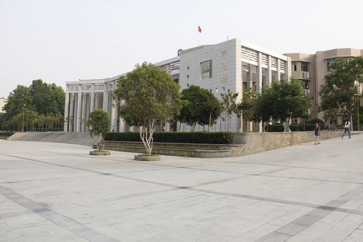

> 收起地铺卧在床板睡觉一直不得安稳，半夜总觉有东西硌我腰。盛怒之下一把把床单揪起，褥穷笔记本现。竟是五年前我的日记本！忍住找了个没人的地儿小心翻阅，呀哒，这熊孩子当年稚嫩得可爱。

先放上俺们高中的下课铃声[^1]，下面是日记摘录(其三)。 



### 二零一四年四月十一日 &nbsp;&nbsp;&nbsp;&nbsp;星期五 &nbsp;&nbsp;&nbsp;&nbsp;小雨转大雨
- - -
天低墨色，小雨微凉。 
时间正是初叶舒展，万物复苏的大好春时，天上蓄了两个月的水气终于凝滴下落了。 
今儿早上天便阴沉沉的，时而有凉风袭来，好不清爽。刚下早自习赶往食堂，便有星星点点的小雨飘扬而下。上午埋头做题的当儿，突然听到同桌低声道：“雨，下紧了。”真的呢！珍珠般的雨滴从天幕上倾下，大珠小珠落入大地这玉盘中，滴答作响，奏出春天的旋律。该放学了，雨却下得更急，像是我们急切还家心情的映照。撑把破了包漆的旧伞，我匆匆踏着路上的积水赶往车站。如此急的雨让排污系统陷入繁忙，未及时排出的积水给行人带来诸多不便：沾湿了脚，弄脏了鞋。衣带溅湿终不悔，家永远是最温暖的港湾。 
我也是这匆匆行人中的一员。突然间回忆起初中一同学，独爱雨中漫步，让雨水打湿头发，聆听自然的歌声，冲淡生活在心灵上涂抹的粉脂。这么好的一场雨，他一定会冒雨在街边多转悠两圈的......在我眼中，这希希拉拉的小雨连同城市的水泥森林，嫣然是一幅意境深远的大写意派泼墨城市画。 
突然的汽车鸣笛声惊破了画卷，短暂的愣神后，眼前的画卷裂成了空中正舞动着的被车溅起的水花。水这种灵动的物质，在时间和空间构成的物质世界中肆意改变着姿态。 
车上，听着初中生们眉飞色舞地讲述着各种事物，稚嫩中流露出他们对成熟的渴望，我又比他们成熟了多少呢？ 
闻着土腥味的风飘然到家，才发现衣服鞋子湿得一塌糊涂，唯有胸前紧抱的背包侥幸逃过雨点的入侵。 
春雨贵如油，咱们现在面临着“地沟油”等食品问题的困扰，然而大自然赠与万物的春雨中却一如既往的滋润甘甜。人呐，就应该如古代圣贤那样向自然母亲学习慷慨、宽容、诚信...... 
- - -
附上俺们学校高三教学楼结束这篇日记吧。

[^1]: 后来才知道，这曲子是[《Moonlow》](https://baike.baidu.com/item/%E6%9C%88%E5%85%89%E6%B0%B4%E5%B2%B8/4153777)。
